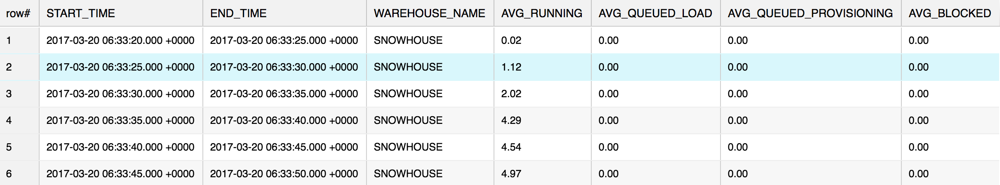
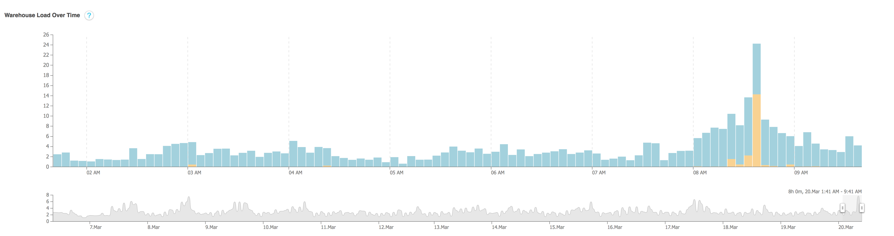

Understanding Your Snowflake Utilization, Part 1: Warehouse Profiling
=====================================================================

This series will take a deeper dive into the Information Schema
(Snowflake's data dictionary) and show you some practical ways to use
this data to better understand your usage of Snowflake.

In this lab, we will discuss how they can implement profiling for your Snowflake account on your own.

The answer is to utilize the Information Schema. Aside from providing a
set of detailed views into Snowflake's metadata store, the Information
Schema goes a step further and provides several powerful table functions
that can be called directly in SQL. These functions can be used to
return historical information about executed queries, data stored in
databases and stages, and virtual warehouse (i.e. compute) usage.

In addition to these functions, I also recommend leveraging the recently
implemented TABLE\_STORAGE\_METRICS view (also in the Information
Schema) to dive even deeper into your analysis.

In this lab, I will show you how to leverage these easy-to-use function
to gather detailed information about the usage of your virtual
warehouses. So let's get started.

### Warehouse Profiling

To profile your current warehouse usage, use
the [WAREHOUSE\_LOAD\_HISTORY] and [WAREHOUSE\_METERING\_HISTORY] functions.
A good way to think about the relationship between these two functions
is that the first one shows how much work was done over a period of time
(**load**) and the second one shows the cost for doing the work
(**metering**).

The syntax for calling these functions is simple, and can be executed in
the **Worksheet** in the Snowflake web interface. For example:

```
use warehouse mywarehouse;

select * from table(information_schema.warehouse_load_history(date_range_start=>dateadd('hour',-1,current_timestamp())));

select * from table(information_schema.warehouse_metering_history(dateadd('hour',-1,current_date()),current_date()));
```

The above queries show warehouse load and credits used for the past hour
for all your warehouses. Be sure to check out the *Usage Notes* section
(in the documentation) for each function to understand all the
requirements and rules. For example, the WAREHOUSE\_LOAD\_HISTORY
function returns results in different intervals based on the timeframe
you specify:

-   5-second intervals when the timeframe is less than 7 hours.
-   5-minute intervals when the timeframe is greater than 7 hours.

**Here's an example of the output from the WAREHOUSE\_LOAD\_HISTORY
query against SNOWHOUSE, a warehouse that we use internally:**



Per our documentation:

-   AVG\_RUNNING -- Average number of queries executed.
-   AVG\_QUEUE\_LOAD -- Average number of queries queued because the
    warehouse was overloaded.
-   AVG\_QUEUE\_PROVISION -- Average number of queries queued because
    the warehouse was being provisioned.
-   AVG\_BLOCKED -- Average number of queries blocked by a transaction
    lock.

**And here's an example of the output from the
WAREHOUSE\_METERING\_HISTORY query against SNOWHOUSE:**


Now that we know the amount of work that was performed during the time
period (via WAREHOUSE\_LOAD\_HISTORY) and the cost per time period (via
WAREHOUSE\_METERING\_HISTORY),  we can perform a simple efficiency ratio
calculation for a particular warehouse. This example returns this
information for a warehouse named XSMALL:

```
with cte as (
  select date_trunc('hour', start_time) as start_time, end_time, warehouse_name, credits_used
  from table(information_schema.warehouse_metering_history(dateadd('days',-1,current_date()),current_date()))
  where warehouse_name = 'XSMALL')
select date_trunc('hour', a.start_time) as start_time, avg(AVG_RUNNING), avg(credits_used), avg(AVG_RUNNING) / avg(credits_used) * 100 
from table(information_schema.warehouse_load_history(dateadd('days',-1,current_date()),current_date())) a
join cte b on a.start_time = date_trunc('hour', a.start_time)
where a.warehouse_name = 'XSMALL'
group by 1
order by 1;
```

In the above query, we are treating the average of AVG\_RUNNING as work
and the average of CREDITS\_USED as cost and we apply a simple
efficiency ratio on both of these values. Feel free to experiment any
way you like.


Next, let's talk about the specific use of WAREHOUSE\_LOAD\_HISTORY in
our example above:

```
select date_trunc('hour', start_time), hour(start_time), avg(avg_running)
from table(information_schema.warehouse_load_history(date_range_start=>dateadd('day',-1,current_timestamp())))
group by date_trunc('hour', start_time), hour(start_time)
order by date_trunc('hour', start_time) asc;
```

Here is the output:


In this case, I'm indeed asking for an average of an average. I'm
grouping the values by hours so I can get a general overview of my
warehouse workload. I can see my warehouse is working almost a full day.
However, if I see some time gaps in this output, then I might do some
additional investigation around those times and see if the warehouse
should be doing work.

Another thing you can see in the output from this function is whether
these time gaps repeat over a few days. If they do, then I would
recommend that you script the warehouse to sleep when not in use (i.e.
to save money), or enable AUTO\_SUSPEND and AUTO\_RESUME for that
warehouse.

The Snowflake web interface also has a nice visual representation of
this function (under the **Warehouse** tab):




Whether you use the visual chart or the manual query, for the four
available metrics, pay particular attention to AVG\_RUNNING. This should
give you an idea how each warehouse performs. If you have split your
workload across several different warehouses, it should tell you how
well your queries are distributed.

AVG\_QUEUE\_LOAD and AVG\_BLOCKED are also interesting and should
provide you with good insight about how well your warehouses are sized.
Keep in mind that queuing is not necessarily a bad thing and you
shouldn't expect zero queuing. The idea is to accept a certain amount of
queuing per time period based on your usage requirements.

Using these metrics, you can determine what to do:

-   Increasing the warehouse size will provide more throughput in
    processing the queries and thereby can help reduce the queuing time.
-   Increasing the cluster count (if using a multi-cluster warehouse)
    will allow more concurrency, which should also help reduce queuing
    and blocking.

#### Finding an Underutilized Warehouse

Is there a warehouse that's underutilized? For example, any similar
sized warehouses being shared across several users could potentially be
consolidated to a single warehouse. You can surface this information by
comparing your AVG\_RUNNING and AVG\_QUEUE\_LOAD scores across your
warehouses:

-   If you see a warehouse with a very low number of queries running,
    you may want to turn that warehouse off and redirect the queries to
    another less used warehouse.
-   If a warehouse is running queries and queuing, perhaps it's time to
    review your workflow to increase your warehouse sizes.
-   If you have built your own client application to interface with
    Snowflake, reviewing your client scripts / application code should
    also reveal any biases towards one warehouse over another.

