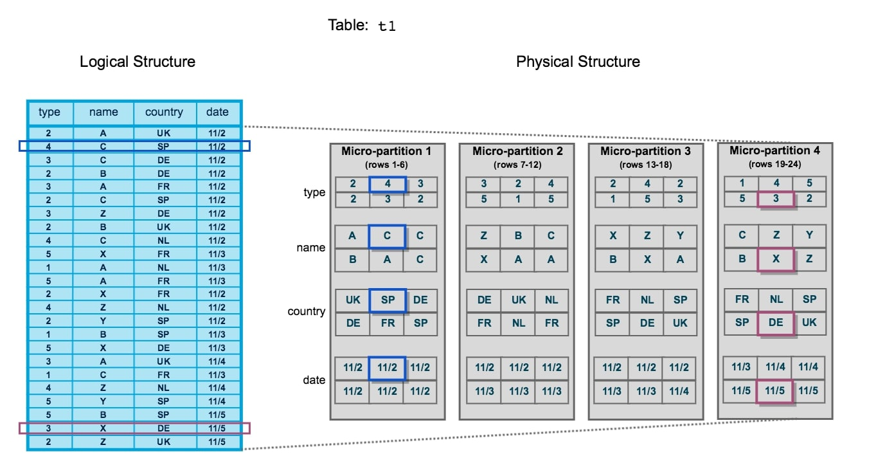
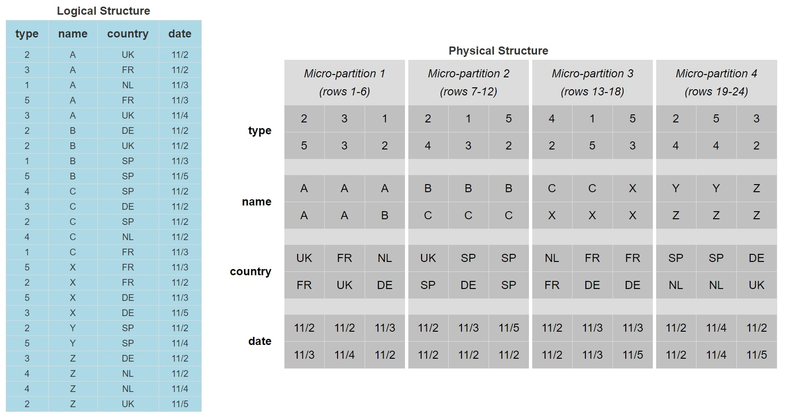
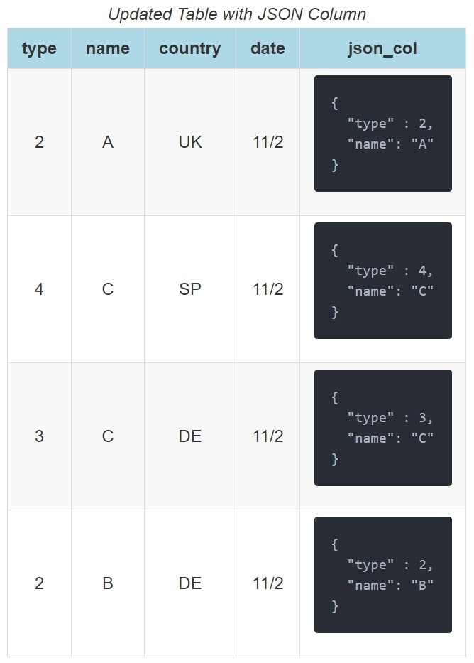
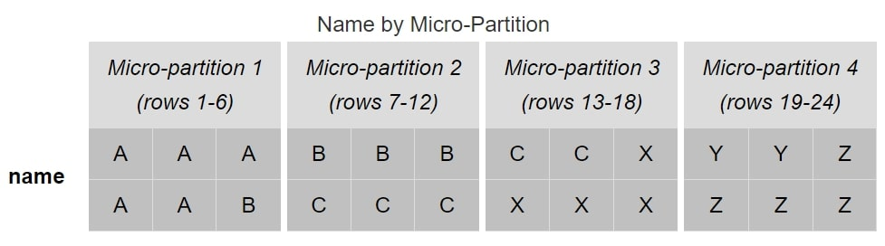
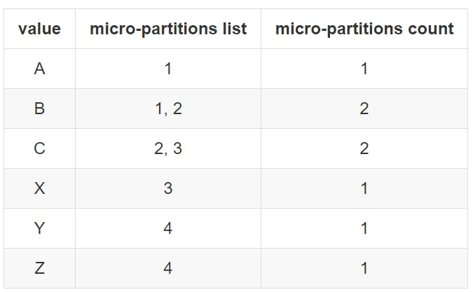
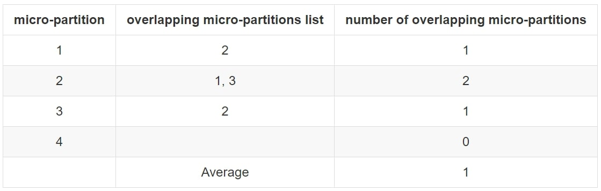
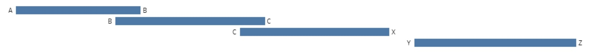
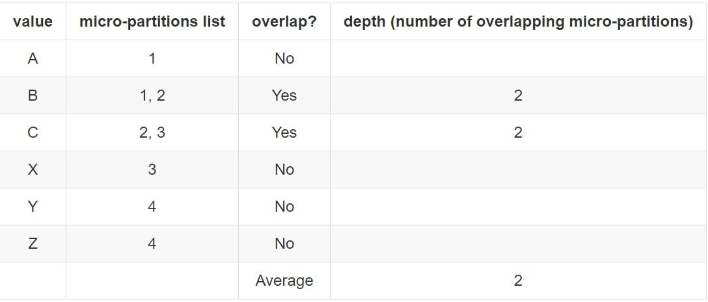
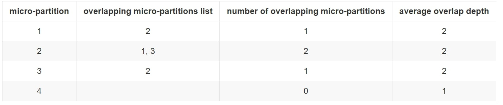
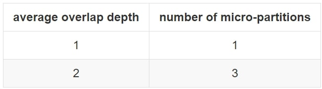

Zero to Snowflake: Automated Clustering in Snowflake
====================================================


One of Snowflake's key selling points is automated clustering. However,
it's not immediately clear what this actually means. It's easy to make
the assumption that you will never need to think about how your data is
clustered, and this is generally the case for tables under 1TB. But if
you have tables larger than this (or if you're interested in general),
definitely keep reading as this may help your query performance!

Snowflake is already designed to efficiently query data and return
results quickly. For larger datasets, providing a little bit of guidance
to Snowflake on how to store the data can significantly reduce query
times. Snowflake cannot determine this itself (how could it know which
columns you are most interested in without you telling it?). However,
once you have told Snowflake which fields are important, it can
automatically keep your data stored in a structure that supports rapid
queries using your key fields. The combination of key fields the user
provides is known as the Clustering Key, but we'll get to that.

Data Storage Architecture and Micro-Partitions
----------------------------------------------

Before we talk about clustering, let's talk about how data is stored and
queried in Snowflake. To the user, Snowflake appears to store data in
tables. To view data in a table, a user would simply use a query and
view the results in the results pane. This is how the front-end works,
but it is not how data is actually being managed and stored by
Snowflake. Instead, Snowflake stores all data in encrypted files which
are referred to as micro-partitions.

Each micro-partition will store a subset of the data, along with some
accompanying metadata. Each micro-partition for a table will be similar
in size, and from the name, you may have deduced that the
micro-partition is small. Specifically, each file in Snowflake is stored
in a compressed state, though if a micro-partition were to be
decompressed, it would be between 50MB and 500MB in size.

The data inside each micro-partition usually spans multiple rows and
columns, but this is not always the case, and it is unusual for a
micro-partition to include every column in a table. Instead,
micro-partitions typically span a handful of columns and rows and
separate the columns within the file.

This is best explained with an example, which is supported by the
following image:



Initially, this can be a confusing diagram to take in. Let's break it
down, starting with the left-hand side. This is how a table would appear
in Snowflake's user interface or as the result of a query. This is
referred to as the logical structure. We have 24 rows of data spanning
four columns: type, name, country and date. Two specific rows of data
have been highlighted: row 2 and row 23.

On the right-hand side is a representation of how this data would be
stored in the backend of Snowflake's architecture. This is referred to
as the physical structure. Here, we can see four separate
micro-partitions, each of which contains six rows of data. The first
micro-partition contains data for rows 1 through 6. The data is stored
by column instead of by row, enabling Snowflake to retrieve desired
columns of data without breaking apart each row.

An alternative way to think about these micro-partitions is by thinking
in terms of semi-structured data arrays. We could represent the physical structure by using four
separate JSON files. For example, the first micro-partition could be
represented as the following JSON array:


```
{
  "columns" : ["type", "name", "country", "date"],
  "rows" : [1, 2, 3, 4, 5, 6],
  "data" : [
    {
      "name": "type",
      "distinct values" : 3,
      "minimum value" : 2,
      "maximum value" : 4,
      "values" : [2, 4, 3, 2, 3, 2]
    },
    {
      "name": "name",
      "distinct values" : 3,
      "minimum value" : "A",
      "maximum value" : "C",
      "values" : ["A", "C", "C", "B", "A", "C"]
    },
    {
      "name": "country",
      "distinct values" : 4,
      "minimum value" : "DE",
      "maximum value" : "UK",
      "values" : ["UK", "SP", "DE", "DE", "FR", "SP"]
    },
    {
      "name": "date",
      "distinct values" : 1,
      "minimum value" : "11/2",
      "maximum value" : "11/2",
      "values" : ["11/2", "11/2", "11/2", "11/2", "11/2", "11/2"]
    }
  ]
}
```

This is a huge over-simplification of the storage method; however, this
JSON representation demonstrates how some metadata is stored, as well as
the values themselves.

Returning to the diagram above, rows 2 and 23 are highlighted on the
left-hand side in blue and magenta, respectively. These align with the
highlighted entries on the right-hand side, so we can see how these are
stored in micro-partitions 1 and 4 respectively.

Query Pruning
-------------

Remember how micro-partitions store metadata in addition to the data
itself? This includes important pieces of information such as which
fields are within the file, the number of distinct values for each
field, the range of values for each field and a few other useful pieces
of information to improve performance.

This metadata is a key part of the Snowflake architecture as it allows
queries to determine whether or not the data inside a micro-partition
should be queried. This way, when a query is executed, it does not need
to scan the entire dataset but instead only queries the micro-partitions
that hold relevant data. This process is known as query pruning, as the
data is pruned before the query itself is executed.

Returning to our example above, imagine a query being executed on that
data to return the **\[type\]** and **\[country\]** for records where
the **\[name\]** is **Y**:


```
SELECT type, country
FROM MY_TABLE
WHERE name = "Y"
;
```

When this query executes in Snowflake, the micro-partitions are quickly
scanned to determine which contain **Y** as a potential entry for the
**\[name\]** field. The only micro-partitions that match this criterion
are micro-partitions 3 and 4. Thus, the query pruning has reduced our
total dataset to just these two partitions. In a similar way, only the
**\[type\]** and **\[country\]** fields are required in the query
output. Any micro-partitions that do not contain data for these columns
would also be pruned. When the micro-partitions themselves are queried,
only the required columns are queried, and Snowflake intelligently
identifies which entries match which rows and can be aligned with the
original **WHERE** clause.

Clustering
----------

Clustering is a common word to encounter when looking behind the scenes
of a data warehouse. The idea behind clustering is to organise the
storage of data to better suit expected queries. The key objectives here
are to improve query performance whilst reducing the system resources
required to execute queries.

For example, imagine a table with over a billion records of data across
many columns. One of these columns is **\[category\]**, which could be
one of 10 possible values. Every day, millions of new records are added,
again spanning these 10 categories.

In our example, whoever is querying this data is only ever interested in
querying one or two categories at a time. With the standard method of
storing data, a query with a **WHERE** clause that targets two
categories would still query a large volume of data to return the right
output. Whenever new data is added, this adds to the volume of data
being queried, and there is no clean way to reduce the dataset before
querying.

In Snowflake terminology, query pruning is less effective as far more
micro-partitions contain multiple categories, and the desired categories
in the query could easily be found in the majority of micro-partitions.

This is where clustering is effective. By restructuring how the data is
stored, it is possible to improve query pruning and reduce the volume of
data queried. Continuing our example, if our data was stored in a
structure that was ordered by the **\[category\]** field, queries would
not need to query the entire dataset. Instead, the query could skip the
data up until a required **\[category\]** value appears, query the
necessary records then skip the next set of records until it reaches
another desired **\[category\]** value.

Let's return to our original example demonstrated by this image:


Again, we will consider the following query:


```
SELECT type, country
FROM MY_TABLE
WHERE name = "Y"
;
```

With how the data is currently stored, this query must investigate
micro-partitions 3 and 4 since both contain the value **Y** in the
**\[name\]** field. If the intended consumer of the data often filtered
the data by the **\[name\]** field, the current method of storing the
data would be inefficient. Instead, we can reorganise the data into the
following logical structure:




The data is now stored and ordered based on the value of the
**\[name\]** field. We can see that micro-partition 4 is now the only
micro-partition that contains **\[name\]** values of **Y**. When we
execute our query now, the query pruning will reduce our target data
down to just micro-partition 4, which means our query has less data to
interpret and thus will perform more efficiently.

Whilst our example has dealt with a small table of only 24 rows and 4
columns, the principle behind this approach is the same as table sizes
increase. Indeed, as tables increase in size, the need to cluster the
data increases with it. Similarly, smaller datasets benefit from
clustering far less than larger datasets, and clustering on these
smaller datasets is often fruitless. Whilst being useful for
demonstrating the logic behind clustering, the table we have used in our
example is far too small to benefit from clustering in any recognisable
way; we would expect this query to complete in under a second whether
the data was clustered or not.


A General Rule to Follow
------------------------

A general rule to follow when considering clustering is to consider if
the table is more than 1TB in size. If so, clustering is recommended. If
not, depending on how large the table is and how well queries are
performing, you may consider clustering but may find it more costly than
it is worth. Personally, I often test clustering by cloning the table
and testing different clustering approaches on said clone. If the query
performance is noticeably improved and worth the cost, I will then
consider applying the clustering approach to the original table and drop
the clone. A few times here I have mentioned cost, which we will revisit
this further down in this lab.

Clustering Keys
---------------

In the above example, we clustered our dataset based on the **\[Name\]**
field, as this was a key field in our data and was used in our queries.
As we have clustered based on this field, this field is referred to as
the **clustering key**. In order to perform the clustering operation on
an existing table using our key, the following SQL statement could be
used:


```
ALTER TABLE MY_TABLE
CLUSTER BY (name)
;
```

In this situation, we are altering an existing table. This does not
always need to be the case, however, as we can define clustering keys at
the time of creation for a table as well:


```
CREATE TABLE MY_TABLE (
    type number
  , name string
  , country string
  , date date
)
CLUSTER BY (name)
;
```


These are very simple examples of creating clustering keys that achieve
our current task. However, there are more capabilities here than meet
the eye. A common question to ask at this stage is: *What if there are
multiple fields that often affect our queries instead of one?*

Whilst we have only used a single field in our example of a clustering
key, this is not the only option. If desired, multiple fields can be
used to define a clustering key. Depending on who you talk to, some
people refer to this as a **composite clustering key**, although it is
common to stick with the original terminology of a clustering key since
the requirement to use multiple fields is so common itself. In this
situation, the order of the fields within the clustering key determines
the precedence. For example, if we wish to cluster by both **\[name\]**
and **\[date\]**, the following query could be used:


```
ALTER TABLE MY_TABLE
CLUSTER BY (name, date)
;
```


As **\[name\]** comes before **\[date\]** in the clustering key, the
data is first clustered by **\[name\]** and then the separate clusters
are clustered by **\[date\]**. So we can include multiple fields in a
clustering key, but why stop there? Another question to ask is: *What if
our queries often apply a function to a specific field?*

Great news: expressions on fields can also be included in a cluster key.
For example, the following query could be used to cluster our table
based on the month and year of the **\[date\]** field:


```
ALTER TABLE MY_TABLE
CLUSTER BY (name, YEAR(date), MONTH(date))
;
```

So far, to be honest, nothing we have discussed in regard to clustering
keys is particularly impressive for anybody accustomed to these tools.
Most data warehouses have clustering capabilities and can define
clustering keys based on multiple fields and expressions on those
fields. Snowflake, however, has a large advantage over many of its
competitors due to its impressive capabilities with semi-structured
data. To demonstrate this effectively, we will need a new example column
in our table. For simplicity, the following example only shows the first
four rows of our table:




Our new field is called **\[json\_col\]** and contains a simple JSON
structure with the **\[type\]** and **\[name\]** for our data. In
Snowflake, it is possible to directly query these entries:


```
SELECT
    json_col:type::number as type
  , json_col:name::string as name
FROM MY_TABLE
WHERE json_col:type::number = 2
;
```


In the exact same way, we can include these expressions in clustering
keys:


```
ALTER TABLE MY_TABLE
CLUSTER BY (json_col:name::string as name, country, YEAR(date), MONTH(date), json_col:type::number as type)
;
```


This last example demonstrates how any of the following can be included
in a clustering key:

1.  Base columns
2.  Expressions on base columns
3.  Expressions on paths in VARIANT columns

Keep in mind when defining clustering keys that it is certainly possible
to go too heavy on the clustering. When too many elements are included
in a clustering key, clustering the data can become too costly. Also,
you may find the data is already clustered as well as it can be by the
first field(s) in the clustering key. In this case, adding further
fields to the clustering key will have no effect on query speeds but
will still be costly to the system as it attempts to implement said
further clustering.

A good principle to follow when choosing which fields should be included
in a cluster key is to first consider which fields most commonly
contribute to the filtering/WHERE clause in a given query. Secondly, you
can consider which fields are used when joining to other tables.

Clustering Information
----------------------

To assist with determining how well-clustered a table is, Snowflake has
provided a system function called **SYSTEM\$CLUSTERING\_INFORMATION**.
This function takes in a table name and a list of columns as inputs and
outputs an overview of how well the table is clustered based on the list
of columns. In effect, the list of columns is the clustering key for
which the clustering information is being provided. You can thus use
this function to determine how the data is clustered across several
possible sets of columns, as well as potentially use this information to
guide your final choice of clustering key for the table.

If no list of columns is provided, the function will instead return the
clustering information for the table based on its current clustering
key. If no current clustering key is defined on the table, the function
will error. The function is executed using a **SELECT** statement, and
it is important to note that both inputs are strings:


```
SELECT SYSTEM$CLUSTERING_INFORMATION('TABLE_NAME', '(COLUMN_1, COLUMN_2, ..., COLUMN_N)')
```


This function returns a single JSON object containing multiple fields
that provide details on various aspects of the table's clustering.


**cluster\_by\_keys**

Snowflake's description of this field:

> [Columns in table used to return clustering information; can be any
> columns in the table.]{style="color: #818181;"}

This is the list of columns that has been provided as an input to the
function or the existing clustering key of the table if the input was
left empty.

**notes**

Description of this field:

> [This column can contain suggestions to make clustering more
> efficient. For example, this field might contain a warning if the
> cardinality of the clustering column is extremely high. This column
> can be empty. ]{style="color: #818181;"}[For more information about
> how to cluster efficiently, see ]{style="color: #818181;"}[Strategies
> for Selecting Clustering
> Keys].


Snowflake have done well by including this field when it is relevant.
When this field appears, it often provides guidance on whether or not
clustering by the input clustering key is a good idea.

A standard and helpful message to see from these notes is that the
cardinality of a particular field in the data is high and may result in
expensive re-clustering. When seeing this message, it is recommended to
consider alternative fields to use in the clustering key which may have
a lower cardinality.


**total\_partition\_count**

Snowflake's description of this field:

> [Total number of micro-partitions that comprise the
> table.]{style="color: #818181;"}

This field simply provides the total number of micro-partitions used to
store the data for the table.

**total\_constant\_partition\_count**

Snowflake's description of this field:

> [Total number of micro-partitions for which the value of the specified
> columns have reached a constant state (i.e. the micro-partitions will
> not benefit significantly from re-clustering). The number of constant
> micro-partitions in a table has an impact on pruning for queries. The
> higher the number, the more micro-partitions can be pruned from
> queries executed on the table, which has a corresponding impact on
> performance.]{style="color: #818181;"}

This field is extremely useful when reviewing the clustering of a table.
As this number increases, we can expect query pruning to improve and
queries to execute more efficiently. Whilst not provided as a field by
this function, I often find it useful to consider the
**total\_constant\_partition\_count** as a percentage of the
**total\_partition\_count**. This provides a useful metric for what
percentage of the data is clustered efficiently.

It is worth keeping in mind that this field should not be the only thing
considered when reviewing clustering since it can lead to false positive
scenarios. For example, our table could contain a boolean field which
only ever has two values. We may find that the
**total\_constant\_partition\_count** is the full
**total\_partition\_count**, which would suggest good clustering.
However, any queries that filter on more than our single boolean field
may not benefit from the clustering as much when pruning.

**average\_overlaps**

Snowflake's description of this field:

> [Average number of overlapping micro-partitions for each
> micro-partition in the table. A high number indicates the table is not
> well-clustered.]{style="color: #818181;"}


In this situation, an overlap is when the same value for a field appears
in more than one micro-partition. Let's return to our previous clustered
example where we clustered based on the **\[name\]** field, specifically
targeting this field:

After this clustering, we can see that each possible **\[name\]** value
may still appear in multiple micro-partitions. Specifically, values
**B** and **C** each appear in two micro-partitions:






From a micro-partition perspective, we have four micro-partitions with
the following overlaps:




Here, we can see the average number of overlapping micro-partitions is 1
and thus the **average\_overlaps** value from the
**SYSTEM\$CLUSTERING\_INFORMATION** function will be 1.

**average\_depth**

Snowflake's description of this field:

> [Average overlap depth of each micro-partition in the table. A high
> number indicates the table is not
> well-clustered.]{style="color: #818181;"}

*This value is also returned by **SYSTEM\$CLUSTERING\_DEPTH**.*

The overlap depth of a micro-partition is the average number of
micro-partitions that an individual value may appear in when an overlap
occurs. Let's return to our previous example again where we have
clustered by **\[name\]**:


The following table again demonstrates the overlapping micro-partitions,
along with the minimum and maximum value in each partition. We can see
that the values **B** and **C** both span multiple micro-partitions. We
could represent this information differently:





We can see from this diagram that we have three overlapping
micro-partitions, but each value only overlaps with a single other
micro-partition each time. Specifically, values **B** and **C** overlap.
We could consider this in terms of values:




This tells us that whilst we have three overlapping micro-partitions (1,
2 and 3), the overlap depth is **2**. Note here how values that did not
overlap at all are not counted in the depth. The purpose of the depth is
to understand more about overlapping data, and including non-overlapping
values would skew this result.

The depth is still considered in terms of micro-partitions instead of
values, so we aggregate this back to the micro-partition level:




**partition\_depth\_histogram**

Snowflake's description of this field:

> [A histogram depicting the distribution of overlap depth for each
> micro-partition in the table. The histogram contains buckets with
> widths of ]{style="color: #818181;"}[0 to 16 with increments of 1.
> ]{style="color: #818181;"}[For buckets larger than 16, increments of
> twice the width of the previous bucket (e.g. 32, 64, 128, . . .
> )]{style="color: #818181;"}


This value takes the overlap depth for each micro-partition and plots it
in a histogram. Let's return to our previous example:


Here, our histogram is quite small, but it works for our simple
demonstration purposes:





Example Output
--------------


Of course, real-world scenarios can be much more complicated than this.
Snowflake provides its own example of a demonstration output of
**system\$clustering\_information** that I have included below:


```
{
  "cluster_by_keys" : "(COL1, COL3)",
  "total_partition_count" : 1156,
  "total_constant_partition_count" : 0,
  "average_overlaps" : 117.5484,
  "average_depth" : 64.0701,
  "partition_depth_histogram" : {
     "00000" : 0,
     "00001" : 0,
     "00002" : 3,
     "00003" : 3,
     "00004" : 4,
     "00005" : 6,
     "00006" : 3,
     "00007" : 5,
     "00008" : 10,
     "00009" : 5,
     "00010" : 7,
     "00011" : 6,
     "00012" : 8,
     "00013" : 8,
     "00014" : 9,
     "00015" : 8,
     "00016" : 6,
     "00032" : 98,
     "00064" : 269,
     "00128" : 698
    }
}
```

Learning how to read and understand these diagrams takes time as there
is a lot of information here. A question to ask yourself: Based on the
information provided in the output above, do you think the table is well
clustered? If so, why? If not, why not?


The Cost of Re-clustering
-------------------------

In Snowflake, (re)clustering is performed in the services layer of the
tool. This means that a virtual warehouse is not required, and Snowflake
has its own way of keeping track of the credit cost. You can see this
yourself in the **Billing & Usage** section of the **Account** area in
your Snowflake environment, under the warehouse
**AUTOMATIC\_CLUSTERING**.


Automated Re-clustering Through Snowflake
-----------------------------------------

This has been a pretty heavy-going lab covering a lot of content, and
we have covered WHY you may want to cluster a table and HOW Snowflake
achieves this clustering. But we haven't touched the best part yet--the
part that separates Snowflake from other similar tools: Snowflake
performs clustering automatically.

In most systems, processes must be put in place to re-cluster a table
after data manipulation has occurred. Maybe one of the fields that
contributes to the clustering key has had its valued changed, or maybe
records have been added to or removed from the table. In most systems,
somebody must either schedule clustering to occur (which may then run
when not required) or manually apply re-clustering as and when it is
deemed to be required.

Snowflake, on the other hand, uses an automated approach that is
controlled by a single flag for each table. This flag is enabled or
disabled using the following commands:

```
ALTER TABLE TABLE_NAME RESUME RECLUSTER;
ALTER TABLE TABLE_NAME SUSPEND RECLUSTER;
```


This is an extremely powerful tool as it takes the entire clustering
process and removes all the irritating admin. The main thing to keep in
mind though is that this can run away with you in terms of credit
consumption if you are not paying attention to the number of objects.
For example, if you create a clone of a table, that clone will default
to have the same clustering information. Snowflake ensures clones
disable automatic clustering by default, but it's recommended to verify
that the clone is clustering the way you want before enabling automated
clustering again.


We can review the clustering for each table with either the **SHOW
TABLES** command or through the tables view of the information schema.
Specifically, the **AUTO\_CLUSTERING\_ON** field can tell you if
clustering is enabled or disabled, and the **CLUSTER\_BY (SHOW TABLES)**
or **CLUSTERING\_KEY** (information schema) field can be used to
determine the current clustering key.

Summary
-------

This lab is an attempt to unlock some of the mystery behind clustering
in Snowflake and explain some of the different ways this can be
evaluated. There is a lot of content here, and I would recommend playing
around with the functionality yourself to reinforce your understanding.
Remember, you can make use of zero-copy cloning to give yourself a few
test tables to play with and try out different clustering methods. As
always, I'd love to hear your thoughts in the comments section down
below. I hope you enjoy the rest of your day!


