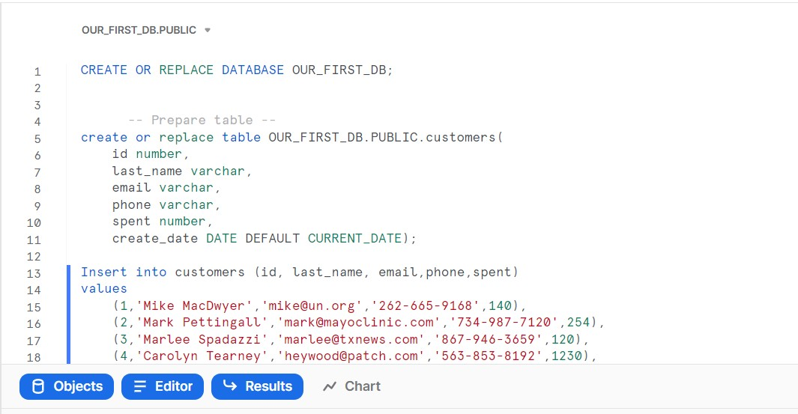
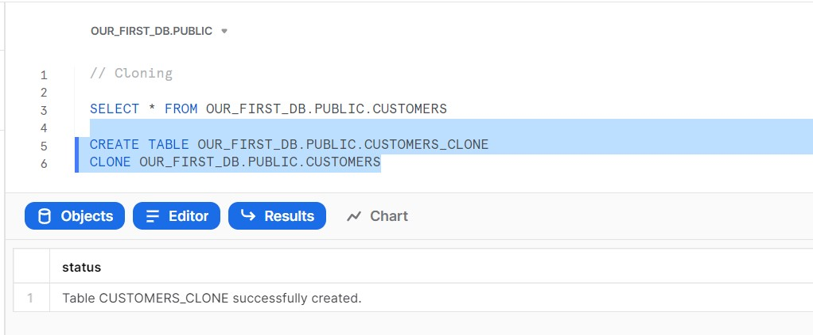
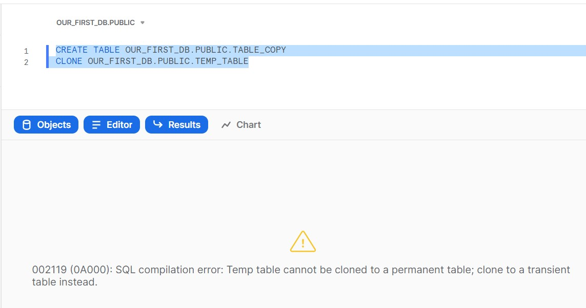

## Lab: Zero Copy Cloning

#### Cloning Tables

Let's have a hands on look now in Snowflake at this cloning feature.
So for this purpose, we will have a look at this customer's table:

```
CREATE OR REPLACE DATABASE OUR_FIRST_DB;

    
      -- Prepare table --
create or replace table OUR_FIRST_DB.PUBLIC.customers(
    id number,
    last_name varchar, 
    email varchar,
    phone varchar,
    spent number,
    create_date DATE DEFAULT CURRENT_DATE);

Insert into customers (id, last_name, email,phone,spent)
values
    (1,'Mike MacDwyer','mike@un.org','262-665-9168',140),
    (2,'Mark Pettingall','mark@mayoclinic.com','734-987-7120',254),
    (3,'Marlee Spadazzi','marlee@txnews.com','867-946-3659',120),
    (4,'Carolyn Tearney','heywood@patch.com','563-853-8192',1230),
    (5,'Marcus Seti','odilia@globo.com','730-451-8637',143),
    (6,'Mike Fenick','mfenick@broward.edu','568-896-6138',600);
```



So we just query this table to see just how this table looks like.
We have this last name,
And then we have here email address and some additional information.
Now we want to create a clone of this table.
We can do this easily just using a new name.
So this will be the new name.
We create this new table.
So we use just this create table command and then we just add here this keyword clone.
And here we reference the source table that we want to clone from.
So if we execute this, let's have a look.


```
// Cloning

SELECT * FROM OUR_FIRST_DB.PUBLIC.CUSTOMERS

CREATE TABLE OUR_FIRST_DB.PUBLIC.CUSTOMERS_CLONE
CLONE OUR_FIRST_DB.PUBLIC.CUSTOMERS
```




So we see this has been executed and now we want to just validate that there is also the same data in
this copied or cloned tape we see it looks pretty good.
We have here all of the same information.
So this has worked.

```
// Validate the data
SELECT * FROM OUR_FIRST_DB.PUBLIC.CUSTOMERS_CLONE
```

And now we just want to update this cloned table.
So we see that here.

```
// Update cloned table

UPDATE OUR_FIRST_DB.public.CUSTOMERS_CLONE
SET LAST_NAME = NULL
```

And now let's query this clone again so that we see we have here now, this now.
But in our original table, this has not been affected.
So this is, of course, what we want.
So in here, we still have this name.


```
SELECT * FROM OUR_FIRST_DB.PUBLIC.CUSTOMERS 

SELECT * FROM OUR_FIRST_DB.PUBLIC.CUSTOMERS_CLONE
```


So now let's also have a look at what happens if we are trying to clone a temporary table, which we
know is not possible in Snowflake.
So for this purpose, we just create this simple temporary table.
So we execute this create this table.
And now we want to clone this temporary table and we see that this will not be possible.
So if we are trying to execute this now, we will get an error message because we have here tried to
clone a temporary table.

```
// Cloning a temporary table is not possible
CREATE OR REPLACE TEMPORARY TABLE OUR_FIRST_DB.PUBLIC.TEMP_TABLE(
  id int)

CREATE TABLE OUR_FIRST_DB.PUBLIC.TABLE_COPY
CLONE OUR_FIRST_DB.PUBLIC.TEMP_TABLE

```



Here we see that it cannot be cloned to a permanent table.
But what is possible is that we clone it to another temporary table.
So if we would make this a temporary table as well, then this would work.
So let's also try and verify this.
And we see this has been now also created and this works.
Now, let's quickly also select this newly created copy.
Of course, we know there is no data and only one column.
So if we query this, we see here is our column.
And of course, there's no data in because we have not put any data here.
So hope this was demonstrating how quickly and easily we can clone tables.


```
// Cloning a temporary table is not possible
CREATE OR REPLACE TEMPORARY TABLE OUR_FIRST_DB.PUBLIC.TEMP_TABLE(
  id int)

CREATE TEMPORARY TABLE OUR_FIRST_DB.PUBLIC.TABLE_COPY
CLONE OUR_FIRST_DB.PUBLIC.TEMP_TABLE

SELECT * FROM OUR_FIRST_DB.PUBLIC.TABLE_COPY
```


Now, let's also have a look at how we can also clone schemas databases and other objects.


#### Cloning Schema and Databases

So let's have a look also at how we can clone schemas and databases, so we see that we have here our
first DBE database and we have here this public schema with a lot of tables and this schema we want
to clone.
So that's why we are referencing here this source schema, our `OUR_FIRST_DB.PUBLIC`, and we want to
create a new schema.
And this is just here also in this database, and it has the name copied schema.


```
// Cloning Schema
CREATE TRANSIENT SCHEMA OUR_FIRST_DB.COPIED_SCHEMA
CLONE OUR_FIRST_DB.PUBLIC;

SELECT * FROM COPIED_SCHEMA.CUSTOMERS
```


We can also clone a database.
So this is the same thing.
And we have also the same command, except that we use here the keyword database.
We create a new database, so we will create a complete copy of this first database.
So you see, the command is very easy.
We just run this and this may take a little while.
So we see after around 23 seconds, this has been also successfully cloned, so let's again refresh
our objects and we see now that we have here, apart from this first CDB, we have also here this copy.
And this has just been created and we see we have everything here.


```
// Cloning Database
CREATE TRANSIENT DATABASE OUR_FIRST_DB_COPY
CLONE OUR_FIRST_DB;

DROP DATABASE OUR_FIRST_DB_COPY

DROP SCHEMA OUR_FIRST_DB.COPIED_SCHEMA
```