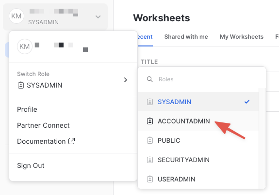
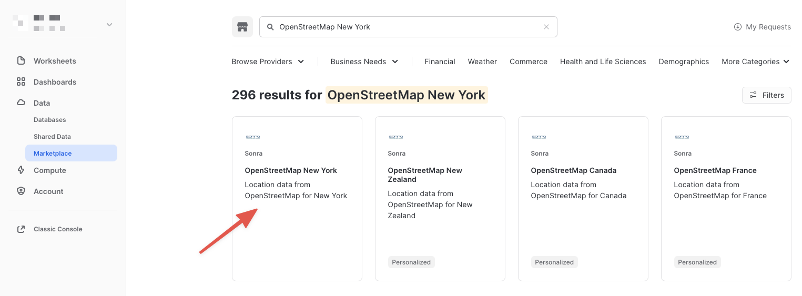
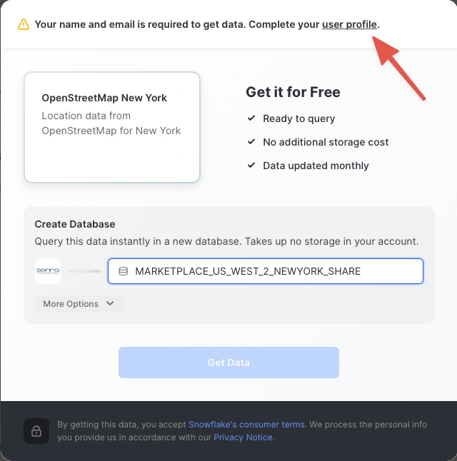
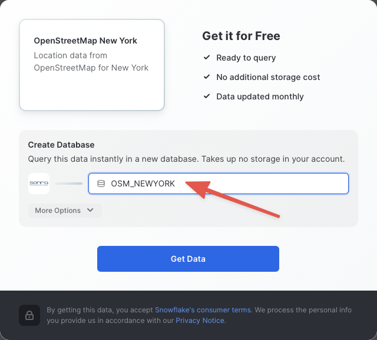
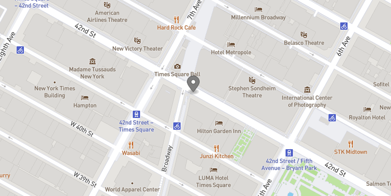
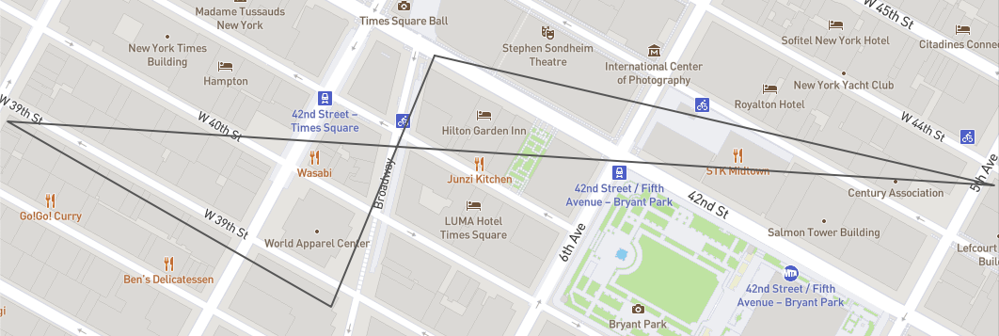
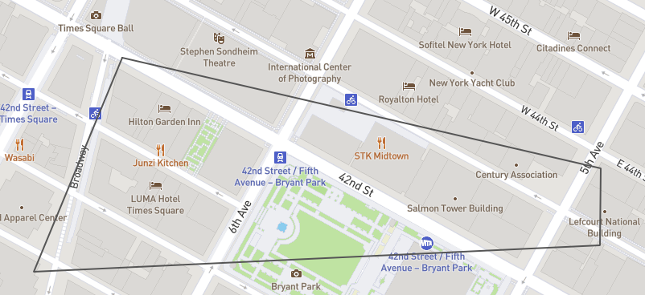
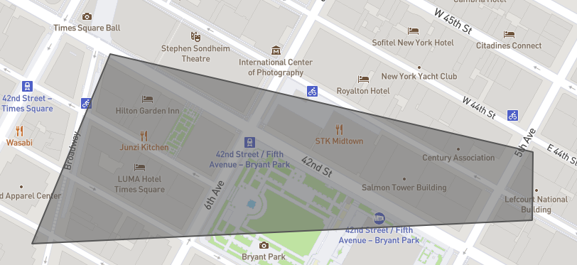
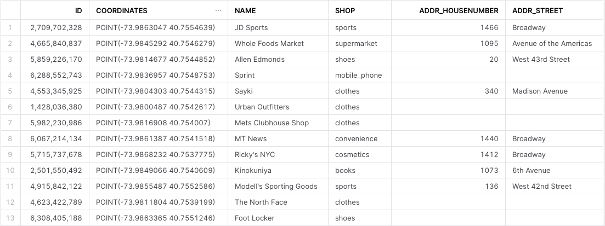
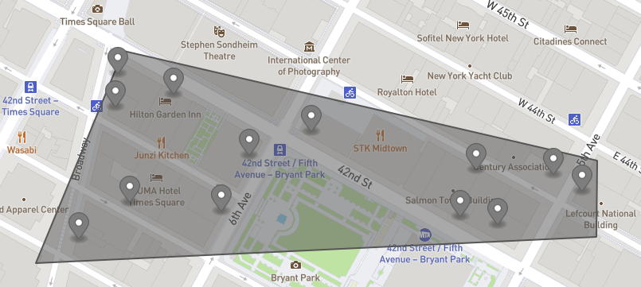

# Getting Started with Geospatial - Geography
<!-- ------------------------ -->
## Overview 


Geospatial query capabilities in Snowflake are built upon a combination of data types and specialized query functions that can be used to parse, construct, and run calculations over geospatial objects. This guide will introduce you to the `GEOGRAPHY` data type, help you understand geospatial formats supported by Snowflake, and walk you through the use of a variety of functions on a sample geospatial data set from the Snowflake Marketplace.  

### Prerequisites
- Quick Video [Introduction to Snowflake](https://www.youtube.com/watch?v=fEtoYweBNQ4&ab_channel=SnowflakeInc.)
- Snowflake [Data Loading Basics](https://www.youtube.com/watch?v=us6MChC8T9Y&ab_channel=SnowflakeInc.) Video

### What You’ll Learn 
- how to acquire geospatial data from the Snowflake Marketplace
- how to interpret the `GEOGRAPHY` data type
- how to understand the different formats that `GEOGRAPHY` can be expressed in
- how to unload/load geospatial data
- how to use parser, constructor, and calculation geospatial functions in queries
- how to perform geospatial joins

### What You’ll Need 
- A supported Snowflake [Browser]
- Sign-up for a [Snowflake Trial](https://signup.snowflake.com/)
  - OR, have access to an existing Snowflake account with the `ACCOUNTADMIN` role or the `IMPORT SHARE` privilege
- Access to the [geojson.io](https://geojson.io) or [WKT Playground](https://clydedacruz.github.io/openstreetmap-wkt-playground/) website

### What You’ll Build 
- A sample use case that involves points-of-interest in New York City.

Negative
: The Marketplace data used in this QuickStart changes from time-to-time, and as such, your query results may be slightly different than indicated in this guide. Additionally, the Snowflake UI changes periodically as well, and instructions/screenshots may be out of date.

<!-- ------------------------ -->
## Acquire Marketplace Data


The first step in the guide is to acquire a geospatial data set that you can freely use to explore the basics of Snowflake's geospatial functionality. The best place to acquire this data is the Snowflake Marketplace!

### Access Snowflake’s Preview Web UI

[app.snowflake.com](https://app.snowflake.com)

If this is the first time you are logging into the new Preview Snowflake UI, you will be prompted to enter your account name or account URL that you were given when you acquired a trial. The account URL contains your [account name] and potentially the region.

Click `Sign-in` and you will be prompted for your user name and password.

Positive
: If this is not the first time you are logging into the new Preview Snowflake UI, you should see a "Select an account to sign into" prompt and a button for your account name listed below it. Click the account you wish to access and you will be prompted for your user name and password (or another authentication mechanism).

### Increase Your Account Permission

The new Preview Snowflake web interface has a lot to offer, but for now, switch your current role from the default `SYSADMIN` to `ACCOUNTADMIN`. This increase in permissions will allow you to create shared databases from Snowflake Marketplace listings. 

Positive
: If you don't have the `ACCOUNTADMIN` role, switch to a role with `IMPORT SHARE` privileges instead.



### Create a Virtual Warehouse (if needed) 

If you don't already have access to a Virtual Warehouse to run queries, you will need to create one. 

- Navigate to the `Compute > Warehouses` screen using the menu on the left side of the window
- Click the big blue `+ Warehouse` button in the upper right of the window
- Create an X-Small Warehouse as shown in the screen below


Be sure to change the `Suspend After (min)` field to 1 min to avoid wasting compute credits.

### Acquire Data from the Snowflake Marketplace

Now you can acquire sample geospatial data from the Snowflake Marketplace.

- Navigate to the `Marketplace` screen using the menu on the left side of the window
- Search for `OpenStreetMap New York` in the search bar
- Find and click the `Sonra OpenStreetMap New York` tile



- Once in the listing, click the big blue `Get Data` button

Negative
: On the `Get Data` screen, you may be prompted to complete your `user profile` if you have not done so before. Click the link as shown in the screenshot below. Enter your name and email address into the profile screen and click the blue `Save` button. You will be returned to the `Get Data` screen.



- On the `Get Data` screen, change the name of the database from the default to `OSM_NEWYORK`, as this name is shorter and all of the future instructions will assume this name for the database.



Congratulations! You have just created a shared database from a listing on the Snowflake Marketplace. Click the big blue `Query Data` button and advance to the next step in the guide.

<!-- ------------------------ -->
## Understand Geospatial Formats


The final step in the prior section opened a worksheet editor in the new Snowflake UI with a few pre-populated queries that came from the sample queries defined in the Marketplace listing. You are not going to run any of these queries in this guide, but you are welcome to run them later. Instead, you are going to open a new worksheet editor and run different queries to understand how the `GEOGRAPHY` data type works in Snowflake.

### Open a New Worksheet and Choose Your Warehouse

- Click the big plus (+) button in the upper right of your browser window. This will open a new window or a new tab, or you may need to allow your browser to open the window/tab depending on your browser pop-up blocker settings.
- In the new Window, make sure `ACCOUNTADMIN` and `MY_WH` (or whatever your warehouse is named) are selected in the box beside the big plus (+) button in the upper right of your browser window.
- In the object browser on the left, expand the `OSM_NEWYORK` database, the `NEW_YORK` schema, and the `Views` grouping to see the various views that you have access to in this shared database. The data provider has chosen to share only database views in this listing. You will use some of these views throughout the guide.

Now you are ready to run some queries.

### The GEOGRAPHY data type

Snowflake's `GEOGRAPHY` data type is similar to the `GEOGRAPHY` data type in other geospatial databases in that it treats all points as longitude and latitude on a spherical earth instead of a flat plane. This is an important distinction from other geospatial types (such as `GEOMETRY`), but this guide won't be exploring those distinctions. More information about Snowflake's specification can be found [here].

Look at one of the views in the shared database which has a `GEOGRAPHY` column by running the following queries. Copy & paste the SQL below into your worksheet editor, put your cursor somewhere in the text of the query you want to run (usually the beginning or end), and either click the blue "Play" button in the upper right of your browser window, or press `CTRL+Enter` or `CMD+Enter` (Windows or Mac) to run the query.

```
// Set the working database schema
use schema osm_newyork.new_york;
```

The [use schema] command sets the active database.schema for your future queries so you do not have to fully qualify your objects.

```
// Describe the v_osm_ny_shop_electronics view 
desc view v_osm_ny_shop_electronics;
```

The [desc or describe] command shows you the definition of the view, including the columns, their data type, and other relevant details. Notice the `coordinates` column is defined of `GEOGRAPHY` type. This is the column you will focus on in the next steps.

### View GEOGRAPHY Output Formats

Snowflake supports 3 primary geospatial formats and 2 additional variations on those formats. They are:

- **GeoJSON**: a JSON-based standard for representing geospatial data
- **WKT & EWKT**: a "Well Known Text" string format for representing geospatial data and the "Extended" variation of that format
- **WKB & EWKB**: a "Well Known Binary" format for representing geospatial data in binary and the "Extended" variation of that format

These formats are supported for ingestion (files containing those formats can be loaded into a `GEOGRAPHY` typed column), query result display, and data unloading to new files. You don't need to worry about how Snowflake stores the data under the covers, but rather how the data is displayed to you or unloaded to files through the value of a session variable called `GEOGRAPHY_OUTPUT_FORMAT`. 

Run the query below to make sure the current format is GeoJSON.

```
// Set the output format to GeoJSON
alter session set geography_output_format = 'GEOJSON';
```

The [alter session] command lets you set a parameter for your current user session, which in this case is the `GEOGRAPHY_OUTPUT_FORMAT`. The default value for this parameter is `'GEOJSON'`, so normally you wouldn't have to run this command if you want that format, but this guide wants to be certain the next queries are run with the `'GEOJSON'` output.

Now run the following query against the `V_OSM_NY_SHOP_ELECTRONICS` view.

```
// Query the v_osm_ny_shop_electronics view for rows of type 'node' (long/lat points)
select coordinates, name from v_osm_ny_shop_electronics where type = 'node' limit 25;
```

In the result set, notice the `coordinates` column and how it displays a JSON representation of a point. It should look something like this:

```json
{   "coordinates": [     -7.390351649999999e+01,     4.074499730000000e+01   ],   "type": "Point" }
```

If you click on a cell in the `coordinates` column of the query result, the JSON representation will also show in the cell panel on the right side of the query window, and it includes a button that allows you to copy that JSON text (see screenshot below). You will use this capability in later exercises.


Now run the next query.

```
// Query the v_osm_ny_shop_electronics view for rows of type 'way' (a collection of many points)
select coordinates, name from v_osm_ny_shop_electronics where type = 'way' limit 25;
```

Click on a cell in the `coordinates` column of the query result. Notice in the cell panel how the JSON is expanded with many more points in the JSON array. This shows you the difference between a geospatial representation of a single point, vs a representation of many points.

Now look at the same queries but in a different format. Run the following query:

```
// Set the output format to WKT
alter session set geography_output_format = 'WKT';
```

Run the previous two queries again. With each run, click on a cell in the `coordinates` column and examine the output.

```
select coordinates, name from v_osm_ny_shop_electronics where type = 'node' limit 25;
select coordinates, name from v_osm_ny_shop_electronics where type = 'way' limit 25;
```

WKT looks different than GeoJSON, and is arguably more readable. Here you can more clearly see the [geospatial object types] which are represented below in the example output:

```console
// An example of a POINT
POINT(-74.0266511 40.6346599)
// An example of a POLYGON
POLYGON((-74.339971 43.0631175,-74.3397734 43.0631363,-74.3397902 43.0632306,-74.3399878 43.0632117,-74.339971 43.0631175))
```

Positive
: You will use several different geospatial object types in this guide, and the guide will explain them more in later sections as you use them.

Lastly, look at WKB output. Run the following query:

```
// Set the output format to WKB
alter session set geography_output_format = 'WKB';
```

And run the two queries again, click on a cell in the `coordinates` column each time.

```
select coordinates, name from v_osm_ny_shop_electronics where type = 'node' limit 25;
select coordinates, name from v_osm_ny_shop_electronics where type = 'way' limit 25;
```

Notice how WKB is incomprehensible to a human reader. Other than the length of the binary value, it's hard to tell the difference between the `POINT` and the `POLYGON`. However, this format is handy in data loading/unloading, as you'll see in the next section.

<!-- ------------------------ -->
## Unload/Load Data


Now that you understand the different output formats, you can create new files from the electronics view, then load those files into new tables with the `GEOGRAPHY` data type. You will also encounter your first examples of geospatial _parsers_ and _constructors_.

### Create New WKB Files From Queries

In this step we're going to use Snowflake's [COPY into location] feature to take the output of a query and create a file in your local [user stage]. Because your output format is set to WKB, the geospatial column in that table will be represented in the WKB format in the new files.

Negative
: The WKB format is being chosen here for its simplicity within a file. Since WKB is a single alpha-numeric string with no delimiters, spaces, or other difficult characters, it is excellent for storing geospatial data in a file. That doesn't mean other formats are to be avoided in real world use cases, but WKB will make your work easier in this guide.

Make sure we're using the WKB output format by running this query again:

```
alter session set geography_output_format = 'WKB';
```

If you're not familiar with the anatomy of a `COPY` command, the code comments below will break down the code of the first query, which copies a few columns and all rows from the electronics view:

```
// Define the write location (@~/ = my user stage) and file name for the file 
copy into @~/osm_ny_shop_electronics_all.csv 
// Define the query that represents the data output
from (select id,coordinates,name,type from v_osm_ny_shop_electronics) 
// Indicate the comma-delimited file format and tell it to double-quote strings
file_format=(type=csv field_optionally_enclosed_by='"') 
// Tell Snowflake to write one file and overwrite it if it already exists
single=true overwrite=true;
```

Run the query above and you should see an output that indicates the number of rows that were unloaded.

Run the second unload query below, which adds some filtering to the output query and a parser:

```
copy into @~/osm_ny_shop_electronics_points.csv 
from (
  select id,coordinates,name,type,st_x(coordinates),st_y(coordinates) 
  from v_osm_ny_shop_electronics where type='node'
) file_format=(type=csv field_optionally_enclosed_by='"') 
single=true overwrite=true;
```

In this query, the parsers `ST_X` and `ST_Y` are extracting the longitude and latitude from a `GEOGRAPHY POINT` object. These parsers only accept single points as an input, so you had to filter the query on `type = 'node'`. In Snowflake, the 'x' coordinate is always the longitude and the 'y' coordinate is always the latitude, and as you will see in a future constructor, the longitude is always listed first.

### LIST and Query User Staged Files

You should now have 2 files in your user stage. Verify they are there by running the [list] command. The 'osm' string will act as a filter to tell the command to show only the files beginning with 'osm'.

```
list @~/osm;
  ```
  
You can query a simple file directly in the stage by using the '$' notation below to represent each delimited column in the file, which in this case Snowflake assumes to be a comma-delimited CSV. Run this query:

```
select $1,$2,$3,$4 from @~/osm_ny_shop_electronics_all.csv;
```

Notice how the second column displays the WKB geospatial data in double-quotes because of how you created the file. This will not load directly into a `GEOGRAPHY` data type, so you need to further define the file format. Run each query below to create a local database and a new file format in that database. You will also switch your `GEOGRAPHY` output format back to WKT to improve readability of future queries.

```
// Create a new local database
create or replace database geocodelab;
// Change your working schema to the public schema in that database
use schema geocodelab.public;
// Create a new file format in that schema
create or replace file format geocsv type = 'csv' field_optionally_enclosed_by='"';
// Set the output format back to WKT
alter session set geography_output_format = 'WKT';
```

Now query the 'all' files in the stage using the file format:

```
select $1,TO_GEOGRAPHY($2),$3,$4 
from @~/osm_ny_shop_electronics_all.csv 
(file_format => 'geocsv');
```

Notice the use of the `TO_GEOGRAPHY` constructor which tells Snowflake to interpret the WKB binary string as geospatial data and construct a `GEOGRAPHY` type. The WKT output format allows you to see this representation in a more readable form. You can now load this file into a table that includes a `GEOGRAPHY` typed column by running the two queries below:

```
// Create a new 'all' table in the current schema
create or replace table electronics_all 
(id number, coordinates geography, name string, type string);
// Load the 'all' file into the table
copy into electronics_all from @~/osm_ny_shop_electronics_all.csv 
file_format=(format_name='geocsv');
```

You should see all rows loaded successfully into the table with 0 errors seen.

Now turn your attention to the other 'points' file. If you recall, you used `ST_X` and `ST_Y` to make discrete longitude and latitude columns in this file. It is not uncommon to receive data which contains these values in different columns, and you can use the `ST_MAKEPOINT` constructor to combine two discrete longitude and latitude columns into one `GEOGRAPHY` typed column. Run this query:

```
select $1,ST_MAKEPOINT($5,$6),$3,$4,$5,$6 
from @~/osm_ny_shop_electronics_points.csv 
(file_format => 'geocsv');
```

Negative
: Notice in `ST_MAKEPOINT` that the longitude column is listed first. Despite the common verbal phrase "lat long," you always put longitude before latitude to represent a geospatial POINT object in Snowflake.

Now create a table and load the 'points' file into that table. Run these two queries.

```
// Create a new 'points' table in the current schema
create or replace table electronics_points 
(id number, coordinates geography, name string, type string, 
long number(38,7), lat number(38,7));
// Load the 'points' file into the table
copy into electronics_points from (
  select $1,ST_MAKEPOINT($5,$6),$3,$4,$5,$6 
  from @~/osm_ny_shop_electronics_points.csv
) file_format=(format_name='geocsv');
```

You should see all rows loaded successfully into the table with 0 errors seen.

Positive
: In the 'all' file load statement, you didn't have to specify a query to load the file because when you have a column in a file that is already in a Snowflake supported geospatial format, and load that value into a `GEOGRAPHY` typed column, Snowflake automatically does the geospatial construction for you. In the 'points' file, however, you must use a transform query to construct two discrete columns into a single `GEOGRAPHY` column using a geospatial constructor function.

To conclude this section, you can query your recently loaded tables using the two queries below:

```
select * from electronics_all;
select * from electronics_points;
```

<!-- ------------------------ -->
## Calculations and More Constructors


Now that you have the basic understand of how the `GEOGRAPHY` data type works and what a geospatial representation of data looks like in various output formats, it's time to walkthrough a scenario that requires you to run some geospatial queries to answer some questions.

Positive
: It's worth noting here that the scenario in the next three sections is more akin to what a person would do with a map application on their mobile phone, rather than how geospatial data would be used in fictional business setting. This was chosen intentionally to make this guide and these queries more relatable to the person doing the guide, rather than trying to create a realistic business scenario that is relatable to all industries, since geospatial data is used very differently across industries.

Before you begin the scenario, switch the active schema back to the shared database and make sure the output format is either GeoJSON or WKT, as you will be using another website to visualize the query results. Which output you choose will be based on your personal preference - WKT is easier for the casual person to read, while GeoJSON is arguably more common. The GeoJSON visualization tool is easier to see the points, lines, and shapes, so this guide will be showing the output for GeoJSON.

Also note that from here on out, SQL statements and functions that have been previously covered will no longer have their usage explained in the code comments or the text of the guide. Run the two queries below:

```
use schema osm_newyork.new_york;
// Run just one of the below queries based on your preference
alter session set geography_output_format = 'GEOJSON';
alter session set geography_output_format = 'WKT';
```

### The Scenario

Pretend that you are currently living in your apartment near Times Square in New York City. You need to make a shopping run to Best Buy and the liquor store, as well as grab a coffee at a coffee shop. Based on your current location, what are the closest stores or shops to do these errands, and are they the most optimal locations to go to collectively? Are there other shops you could stop at along the way?

Start with running a query that represents your current location. This location has been preselected for the guide using a website that returns longitude and latitude when you click on a location on a map. Run this query:

```
select to_geography('POINT(-73.986226 40.755702)');
```

Notice there is no `from` clause in this query, which allows you to construct a `GEOGRAPHY` object in a simple `select` statement.

Negative
: `POINT(-73.986226 40.755702)` is already a geography object in WKT format, so there was no real need to convert it again, but it was important to show the most basic way to use `TO_GEOGRAPHY` to construct a simple geography object.

- Click on the data cell that was returned and copy the `POINT` object using the method demonstrated earlier by clicking on the copy button in the cell panel on the right.
- Navigate to the [geojson.io](https://geojson.io) or [WKT Playground](https://clydedacruz.github.io/openstreetmap-wkt-playground/) website and clear the contents of the text box.
- Paste your `POINT` object into the text box (and click `PLOT SHAPE` for the WKT Playground).
- Use the map zoom controls (+/- buttons) and click the zoom out (-) button until you can see more of the New York City surroundings. You should see something like the screenshot below, though you may see more depending on your browser window size and how far you zoomed out.



In the image above, the dark grey map location icon represents the `POINT` object location. Now you know where you are!

### Find the Closest Locations

In the next step, you are going to run queries to find the closest Best Buy, liquor store, and coffee shop to your current location from above. These queries are very similar and will do several things:

- One will query the electronics view, the other two will query the food & beverages view, applying appropriate filters to find the thing we're looking for.
- All queries will use the `ST_DWITHIN` function in the `where` clause to filter out stores that aren't within the stated distance. The function takes two points and a distance to determine whether those two points are less than or equal to the stated distance from each other, returning `true` if they are and `false` if they are not. In this function, you will use the `coordinates` column from each view to scan through all of the Best Buys, liquor stores, or coffee shops and compare them to your current location `POINT`, which you will construct using the previously used `ST_MAKEPOINT`. You will then use 1600 meters for the distance value, which is roughly equivalent to a US mile.
  - Note that in the queries below, the syntax `ST_DWITHIN(...) = true` is used for readability, but the `= true` is not required for the filter to work. It is required if you were to need an `= false` condition.
- All queries will also use the `ST_DISTANCE` function, which actually gives you a value in meters representing the distance between the two points. When combined with `order by` and `limit` clauses, this will help you return only the row that is the smallest distance, or closest.
  - Also note in `ST_DISTANCE` that you use the constructor `TO_GEOGRAPHY` for your current location point instead of the `ST_MAKEPOINT` constructor that you used earlier in `ST_DWITHIN`. This is to show you that that `TO_GEOGRAPHY` is a general purpose constructor where `ST_MAKEPOINT` specifically makes a `POINT` object, but in this situation they resolve to the same output. Sometimes there is more than one valid approach to construct a geospatial object.
  
Run the following queries (the first one has comments similar to above):

```
// Find the closest Best Buy
select id, coordinates, name, addr_housenumber, addr_street, 
// Use st_distance to calculate the distance between your location and Best Buy
st_distance(coordinates,to_geography('POINT(-73.986226 40.755702)'))::number(6,2) 
as distance_meters 
from v_osm_ny_shop_electronics 
// Filter just for Best Buys
where name = 'Best Buy' and 
// Filter for Best Buys that are within about a US mile (1600 meters)
st_dwithin(coordinates,st_makepoint(-73.986226, 40.755702),1600) = true 
// Order the results by the calculated distance and only return the lowest
order by 6 limit 1;

// Find the closest liquor store
select id, coordinates, name, addr_housenumber, addr_street, 
st_distance(coordinates,to_geography('POINT(-73.986226 40.755702)'))::number(6,2) 
as distance_meters 
from v_osm_ny_shop_food_beverages 
where shop = 'alcohol' and 
st_dwithin(coordinates,st_makepoint(-73.986226, 40.755702),1600) = true 
order by 6 limit 1;

// Find the closest coffee shop
select id, coordinates, name, addr_housenumber, addr_street, 
st_distance(coordinates,to_geography('POINT(-73.986226 40.755702)'))::number(6,2) 
as distance_meters 
from v_osm_ny_shop_food_beverages 
where shop = 'coffee' and 
st_dwithin(coordinates,st_makepoint(-73.986226, 40.755702),1600) = true 
order by 6 limit 1;
```

In each case, the query returns a `POINT` object, which you aren't going to do anything with just yet, but now you have the queries that return the desired results. It would be really nice, however, if you could easily visualize how these points relate to each other.

### Collect Points Into a Line

In the next step of this section, you're going to 'collect' the points using `ST_COLLECT` and make a `LINESTRING` object with the `ST_MAKELINE` constructor. You will then be able to visualize this line on geojson.io.

- The first step in the query to is create a common table expression (CTE) query that unions together the queries you ran in the above step (keeping just the `coordinates` and `distance_meters` columns). This CTE will result in a 4 row output - 1 row for your current location, 1 row for the Best Buy location, 1 row for the liquor store, and 1 row for the coffee shop.
- You will then use `ST_COLLECT` to aggregate those 4 rows in the `coordinates` column into a single geospatial object, a `MULTIPOINT`. This object type is a collection of `POINT` objects that are interpreted as having no connection to each other other than they are grouped. A visualization tool will not connect these points, just plot them, so in the next step you'll turn these points into a line.

Run this query and examine the output:

```
// Create the CTE 'locations'
with locations as (
(select to_geography('POINT(-73.986226 40.755702)') as coordinates, 
0 as distance_meters)
union all
(select coordinates, 
st_distance(coordinates,to_geography('POINT(-73.986226 40.755702)'))::number(6,2) 
as distance_meters from v_osm_ny_shop_electronics 
where name = 'Best Buy' and 
st_dwithin(coordinates,st_makepoint(-73.986226, 40.755702),1600) = true 
order by 2 limit 1)
union all
(select coordinates, 
st_distance(coordinates,to_geography('POINT(-73.986226 40.755702)'))::number(6,2) 
as distance_meters from v_osm_ny_shop_food_beverages 
where shop = 'alcohol' and 
st_dwithin(coordinates,st_makepoint(-73.986226, 40.755702),1600) = true 
order by 2 limit 1)
union all
(select coordinates, 
st_distance(coordinates,to_geography('POINT(-73.986226 40.755702)'))::number(6,2) 
as distance_meters from v_osm_ny_shop_food_beverages 
where shop = 'coffee' and 
st_dwithin(coordinates,st_makepoint(-73.986226, 40.755702),1600) = true 
order by 2 limit 1))
// Query the CTE result set, aggregating the coordinates into one object
select st_collect(coordinates) as multipoint from locations;
```

The next thing you need to do is convert that `MULTIPOINT` object into a `LINESTRING` object using `ST_MAKELINE`, which takes a set of points as an input and turns them into a `LINESTRING` object. Whereas a `MULTIPOINT` has points with no assumed connection, the points in a `LINESTRING` will be interpreted as connected in the order they appear. Needing a collection of points to feed into `ST_MAKELINE` is the reason why you did the `ST_COLLECT` step above, and the only thing you need to do to the query above is wrap the `ST_COLLECT` in an `ST_LINESTRING` like so:

```
select st_makeline(st_collect(coordinates),to_geography('POINT(-73.986226 40.755702)'))
```

Positive
: You may be wondering why your current position point was added as an additional point in the line when you already included it as the first point in the `MULTIPOINT` collection above? Stay tuned for why you need this later, but logically it makes sense that you plan to go back to your New York City apartment at the end of your shopping trip.

Here is the full query for you to run (without comments):

```
with locations as (
(select to_geography('POINT(-73.986226 40.755702)') as coordinates, 
0 as distance_meters)
union all
(select coordinates, 
st_distance(coordinates,to_geography('POINT(-73.986226 40.755702)'))::number(6,2) 
as distance_meters from v_osm_ny_shop_electronics 
where name = 'Best Buy' and 
st_dwithin(coordinates,st_makepoint(-73.986226, 40.755702),1600) = true 
order by 2 limit 1)
union all
(select coordinates, 
st_distance(coordinates,to_geography('POINT(-73.986226 40.755702)'))::number(6,2) 
as distance_meters from v_osm_ny_shop_food_beverages 
where shop = 'alcohol' and 
st_dwithin(coordinates,st_makepoint(-73.986226, 40.755702),1600) = true 
order by 2 limit 1)
union all
(select coordinates, 
st_distance(coordinates,to_geography('POINT(-73.986226 40.755702)'))::number(6,2) 
as distance_meters from v_osm_ny_shop_food_beverages 
where shop = 'coffee' and 
st_dwithin(coordinates,st_makepoint(-73.986226, 40.755702),1600) = true 
order by 2 limit 1))
select st_makeline(st_collect(coordinates),to_geography('POINT(-73.986226 40.755702)'))
as linestring from locations;
```

Copy the result cell from the above query and paste it into geojson.io. You should get this:



Yikes! You can see in the image above that the various shops are in three different directions from your original location. That could be a long walk. Fortunately, you can find out just how long by wrapping a `ST_DISTANCE` function around the `LINESTRING` object, which will calculate the length of the line in meters. Run the query below:

```
with locations as (
(select to_geography('POINT(-73.986226 40.755702)') as coordinates, 
0 as distance_meters)
union all
(select coordinates, 
st_distance(coordinates,to_geography('POINT(-73.986226 40.755702)'))::number(6,2) 
as distance_meters from v_osm_ny_shop_electronics 
where name = 'Best Buy' and 
st_dwithin(coordinates,st_makepoint(-73.986226, 40.755702),1600) = true 
order by 2 limit 1)
union all
(select coordinates, 
st_distance(coordinates,to_geography('POINT(-73.986226 40.755702)'))::number(6,2) 
as distance_meters from v_osm_ny_shop_food_beverages 
where shop = 'alcohol' and 
st_dwithin(coordinates,st_makepoint(-73.986226, 40.755702),1600) = true 
order by 2 limit 1)
union all
(select coordinates, 
st_distance(coordinates,to_geography('POINT(-73.986226 40.755702)'))::number(6,2) 
as distance_meters from v_osm_ny_shop_food_beverages 
where shop = 'coffee' and 
st_dwithin(coordinates,st_makepoint(-73.986226, 40.755702),1600) = true 
order by 2 limit 1))
// Feed the linestring into an st_length calculation
select st_length(st_makeline(st_collect(coordinates),
to_geography('POINT(-73.986226 40.755702)')))
as length_meters from locations;
```

Wow! Almost 2120 meters!

Negative
: It is correct to note that this distance represents a path based on how a bird would fly, rather than how a human would navigate the streets. The point of this exercise is not to generate walking directions, but rather to give you a feel of the various things you can parse, construct, and calculate with geospatial data and functions in Snowflake.

Now move to the next section to see how you can optimize your shopping trip.


<!-- ------------------------ -->
## Joins


In the previous section, all of your queries to find the closest Best Buy, liquor store, and coffee shop were based on proximity to your Times Square apartment. But wouldn't it make more sense to see, for example, if there was a liquor store and/or coffee shop closer to Best Buy? You can use geospatial functions in a table join to find out.

### Is There Anything Closer to Best Buy?

You have been using two views in your queries so far: `v_osm_ny_shop_electronics`, where stores like Best Buy are catalogued, and `v_osm_ny_shop_food_beverage`, where liquor stores and coffee shops are catalogued. To find the latter near the former, you'll join these two tables. The new queries introduce a few changes:

- The electronics view will serve as the primary view in the query, where you'll put a filter on the known Best Buy store using its id value from the view.
- Instead of the `JOIN` clause using a common `a.key = b.key` foreign key condition, the `ST_DWITHIN` function will serve as the join condition (remember before the note about not needing to include the `= true` part).
- The `ST_DISTANCE` calculation is now using the Best Buy coordinate and all of the other coordinates in the food & beverage view to determine the closest liquor store and coffee shop location to Best Buy.

Run the two queries below (only the first is commented):

```
// Join to electronics to find a liquor store closer to Best Buy
select fb.id,fb.coordinates,fb.name,fb.addr_housenumber,fb.addr_street,
// The st_distance calculation uses coordinates from both views
st_distance(e.coordinates,fb.coordinates) as distance_meters 
from v_osm_ny_shop_electronics e 
// The join is based on being within a certain distance
join v_osm_ny_shop_food_beverages fb on st_dwithin(e.coordinates,fb.coordinates,1600) 
// Hard-coding the known Best Buy id below
where e.id = 1428036403 and fb.shop = 'alcohol' 
// Ordering by distance and only showing the lowest
order by 6 limit 1;

// Join to electronics to find a coffee shop closer to Best Buy
select fb.id,fb.coordinates,fb.name,fb.addr_housenumber,fb.addr_street,
st_distance(e.coordinates,fb.coordinates) as distance_meters 
from v_osm_ny_shop_electronics e 
join v_osm_ny_shop_food_beverages fb on st_dwithin(e.coordinates,fb.coordinates,1600) 
where e.id = 1428036403 and fb.shop = 'coffee' 
order by 6 limit 1;
```

If you note in the result of each query, the first query found a different liquor store closer to Best Buy, whereas the second query returned the same coffee shop from your original search, so you've optimized as much as you can. 

Negative
: The id of the selected Best Buy was hard coded into the above queries to keep them easier to read and to keep you focused on the join clause of these queries, rather than introducing sub queries to dynamically calculate the nearest Best Buy. Those sub queries would have created longer queries that were harder to read.

Positive
: If you're feeling adventurous, go read about other possible relationship functions that could be used in the join for this scenario [here].

### Calculate a New Linestring

Now that you know that there is a better option for the liquor store, substitute the above liquor store query into the original linestring query to produce a different object. For visualization sake, the order of the statements in the unions have been changed, which affects the order of the points in the object.

```
with locations as (
(select to_geography('POINT(-73.986226 40.755702)') as coordinates, 
0 as distance_meters)
union all
(select coordinates, 
st_distance(coordinates,to_geography('POINT(-73.986226 40.755702)'))::number(6,2) 
as distance_meters 
from v_osm_ny_shop_food_beverages 
where shop = 'coffee' and 
st_dwithin(coordinates,st_makepoint(-73.986226, 40.755702),1600) = true 
order by 2 limit 1)
union all
(select fb.coordinates, st_distance(e.coordinates,fb.coordinates) as distance_meters 
from v_osm_ny_shop_electronics e 
join v_osm_ny_shop_food_beverages fb on st_dwithin(e.coordinates,fb.coordinates,1600) 
where e.id = 1428036403 and fb.shop = 'alcohol' 
order by 2 limit 1)
union all
(select coordinates, 
st_distance(coordinates,to_geography('POINT(-73.986226 40.755702)'))::number(6,2) 
as distance_meters 
from v_osm_ny_shop_electronics 
where name = 'Best Buy' and 
st_dwithin(coordinates,st_makepoint(-73.986226, 40.755702),1600) = true 
order by 2 limit 1))
select st_makeline(st_collect(coordinates),
to_geography('POINT(-73.986226 40.755702)')) as linestring from locations;
```

Copy the result cell from the above query and paste it into geojson.io. You should get this:



Much better! This looks like a more efficient shopping path. Check the new distance by running this query:

```
with locations as (
(select to_geography('POINT(-73.986226 40.755702)') as coordinates, 
0 as distance_meters)
union all
(select coordinates, 
st_distance(coordinates,to_geography('POINT(-73.986226 40.755702)'))::number(6,2) 
as distance_meters 
from v_osm_ny_shop_food_beverages 
where shop = 'coffee' and 
st_dwithin(coordinates,st_makepoint(-73.986226, 40.755702),1600) = true 
order by 2 limit 1)
union all
(select fb.coordinates, st_distance(e.coordinates,fb.coordinates) as distance_meters 
from v_osm_ny_shop_electronics e 
join v_osm_ny_shop_food_beverages fb on st_dwithin(e.coordinates,fb.coordinates,1600) 
where e.id = 1428036403 and fb.shop = 'alcohol' 
order by 2 limit 1)
union all
(select coordinates, 
st_distance(coordinates,to_geography('POINT(-73.986226 40.755702)'))::number(6,2) 
as distance_meters 
from v_osm_ny_shop_electronics 
where name = 'Best Buy' and 
st_dwithin(coordinates,st_makepoint(-73.986226, 40.755702),1600) = true 
order by 2 limit 1))
select st_length(st_makeline(st_collect(coordinates),
to_geography('POINT(-73.986226 40.755702)'))) 
as length_meters from locations;
```

Nice! 1537 meters, which is a savings of about 583 meters, or a third of a mile. By joining the two shop views together, you were able to find an object in one table that is closest to an object from another table to optimize your route. Now that you have a more optimized route, can you stop at any other shops along the way? Advance to the next section to find out.

<!-- ------------------------ -->

## Additional Calculations and Constructors


The `LINESTRING` object that was created in the previous section looks like a nice, clean, four-sided polygon. As it turns out, a `POLYGON` is another geospatial object type that you can construct and work with. Where you can think of a `LINESTRING` as a border of a shape, a `POLYGON` is the filled version of the shape itself. The key thing about a `POLYGON` is that it must end at its beginning, where a `LINESTRING` does not need to return to the starting point.

Positive
: Remember in a previous section when you added your Times Square Apartment location to both the beginning and the end of the `LINESTRING`? In addition to the logical explanation of returning home after your shopping trip, that point was duplicated at the beginning and end so you can construct a `POLYGON` in this section!

### Construct a Polygon

Constructing a `POLYGON` is done with the `ST_MAKEPOLYGON` function, just like the `ST_MAKELINE`. The only difference is where `ST_MAKELINE` makes a line out of points, `ST_MAKEPOLYGON` makes a polygon out of lines. Therefore, the only thing you need to do to the previous query that constructed the line is to wrap that construction with `ST_MAKEPOLYGON` like this:

```
select st_makepolygon(st_makeline(st_collect(coordinates),
to_geography('POINT(-73.986226 40.755702)')))
```

This really helps illustrate the construction progression: from individual points, to a collection of points, to a line, to a polygon. Run this query to create your polygon:

```
with locations as (
(select to_geography('POINT(-73.986226 40.755702)') as coordinates, 
0 as distance_meters)
union all
(select coordinates, 
st_distance(coordinates,to_geography('POINT(-73.986226 40.755702)'))::number(6,2) 
as distance_meters 
from v_osm_ny_shop_food_beverages 
where shop = 'coffee' and 
st_dwithin(coordinates,st_makepoint(-73.986226, 40.755702),1600) = true 
order by 2 limit 1)
union all
(select fb.coordinates, st_distance(e.coordinates,fb.coordinates) as distance_meters 
from v_osm_ny_shop_electronics e 
join v_osm_ny_shop_food_beverages fb on st_dwithin(e.coordinates,fb.coordinates,1600) 
where e.id = 1428036403 and fb.shop = 'alcohol' 
order by 2 limit 1)
union all
(select coordinates, 
st_distance(coordinates,to_geography('POINT(-73.986226 40.755702)'))::number(6,2) 
as distance_meters 
from v_osm_ny_shop_electronics 
where name = 'Best Buy' and 
st_dwithin(coordinates,st_makepoint(-73.986226, 40.755702),1600) = true 
order by 2 limit 1))
select st_makepolygon(st_makeline(st_collect(coordinates),
to_geography('POINT(-73.986226 40.755702)'))) as polygon from locations;
```

Copy the result cell from the above query and paste it into geosjon.io. You should get this:



And just like before where you could calculate the distance of a `LINESTRING` using `ST_DISTANCE`, you can calculate the perimeter of a `POLYGON` using `ST_PERIMETER`, which you wrap around the polygon construction in the same way you wrapped around the line construction. Run this query to calculate the perimeter:

```
with locations as (
(select to_geography('POINT(-73.986226 40.755702)') as coordinates, 
0 as distance_meters)
union all
(select coordinates, 
st_distance(coordinates,to_geography('POINT(-73.986226 40.755702)'))::number(6,2) 
as distance_meters 
from v_osm_ny_shop_food_beverages 
where shop = 'coffee' and 
st_dwithin(coordinates,st_makepoint(-73.986226, 40.755702),1600) = true 
order by 2 limit 1)
union all
(select fb.coordinates, st_distance(e.coordinates,fb.coordinates) as distance_meters 
from v_osm_ny_shop_electronics e 
join v_osm_ny_shop_food_beverages fb on st_dwithin(e.coordinates,fb.coordinates,1600) 
where e.id = 1428036403 and fb.shop = 'alcohol' 
order by 2 limit 1)
union all
(select coordinates, 
st_distance(coordinates,to_geography('POINT(-73.986226 40.755702)'))::number(6,2) 
as distance_meters 
from v_osm_ny_shop_electronics 
where name = 'Best Buy' and 
st_dwithin(coordinates,st_makepoint(-73.986226, 40.755702),1600) = true 
order by 2 limit 1))
select st_perimeter(st_makepolygon(st_makeline(st_collect(coordinates),
to_geography('POINT(-73.986226 40.755702)')))) as perimeter_meters from locations;
```

Nice! That query returned the same 1537 meters you got before as the distance of the `LINESTRING`, which makes sense, because the perimeter of a `POLYGON` is the same distance as a `LINESTRING` that constructs a `POLYGON`.

### Find Shops Inside The Polygon

The final activity you will do in this guide is to find any type of shop within the `v_osm_ny_shop` view that exists inside of the `POLYGON` you just created in the previous step. This will reveal to you all of the stores you can stop at along your path to your core stops. To accomplish this, here is what you will do to the query that builds the `POLYGON`:

- The `POLYGON` is a result set in its own right, so you are going to wrap this query in another CTE. This will allow you to refer back to the polygon as a singular entity more cleanly in a join. You will call this CTE the `search_area`.
- Then you will join the `v_osm_ny_shop` to the `search area` CTE using the `ST_WITHIN` function, which is different than `ST_DWITHIN`. The `ST_WITHIN` function takes one geospatial object and determines if it is completely inside another geospatial object, returning `true` if it is and `false` if it isn't. In the query, it will determine if any row in `v_osm_ny_shop` is completely inside the `search_area` CTE.

Run this query to see what shops are inside the polygon:

```
// Define the outer CTE 'search_area'
with search_area as (
with locations as (
(select to_geography('POINT(-73.986226 40.755702)') as coordinates, 
0 as distance_meters)
union all
(select coordinates, 
st_distance(coordinates,to_geography('POINT(-73.986226 40.755702)'))::number(6,2) 
as distance_meters 
from v_osm_ny_shop_food_beverages 
where shop = 'coffee' and 
st_dwithin(coordinates,st_makepoint(-73.986226, 40.755702),1600) = true 
order by 2 limit 1)
union all
(select fb.coordinates, 
st_distance(e.coordinates,fb.coordinates) as distance_meters 
from v_osm_ny_shop_electronics e 
join v_osm_ny_shop_food_beverages fb on st_dwithin(e.coordinates,fb.coordinates,1600) 
where e.id = 1428036403 and fb.shop = 'alcohol' 
order by 2 limit 1)
union all
(select coordinates, 
st_distance(coordinates,to_geography('POINT(-73.986226 40.755702)'))::number(6,2) 
as distance_meters 
from v_osm_ny_shop_electronics 
where name = 'Best Buy' and 
st_dwithin(coordinates,st_makepoint(-73.986226, 40.755702),1600) = true 
order by 2 limit 1))
select st_makepolygon(st_makeline(st_collect(coordinates),
to_geography('POINT(-73.986226 40.755702)'))) as polygon from locations)
select sh.id,sh.coordinates,sh.name,sh.shop,sh.addr_housenumber,sh.addr_street 
from v_osm_ny_shop sh 
// Join v_osm_ny_shop to the 'search_area' CTE using st_within
join search_area sa on st_within(sh.coordinates,sa.polygon);
```

You should see similar results as below, though the number of rows may be different (WKT output is shown below for readability):



And your final step will be to construct a single geospatial object that includes both the `POLYGON` you created as well as a `POINT` for every shop inside the `POLYGON`. This single object is known as a `GEOMETRYCOLLECTION`, which a geospatial type that can hold any combination of geospatial objects as one grouping. To create this object, you will do the following:

- Create a CTE that unions the `POLYGON` query with the above query that finds shops inside the polygon, keeping only the necessary `coordinates` column in the latter query for simplicity. This CTE will produce 1 row for the `POLYGON` and rows for each individual shop `POINT` inside the `POLYGON`.
- Use `ST_COLLECT` to aggregate the rows above (1 `POLYGON`, all the `POINTS`) into a single `GEOMETRYCOLLECTION`.

Run the query below:

```
// Define the outer CTE 'final_plot'
with final_plot as (
// Get the original polygon
(with locations as (
(select to_geography('POINT(-73.986226 40.755702)') as coordinates, 
0 as distance_meters)
union all
(select coordinates, 
st_distance(coordinates,to_geography('POINT(-73.986226 40.755702)'))::number(6,2) 
as distance_meters 
from v_osm_ny_shop_food_beverages 
where shop = 'coffee' and 
st_dwithin(coordinates,st_makepoint(-73.986226, 40.755702),1600) = true 
order by 2 limit 1)
union all
(select fb.coordinates, 
st_distance(e.coordinates,fb.coordinates) as distance_meters 
from v_osm_ny_shop_electronics e 
join v_osm_ny_shop_food_beverages fb on st_dwithin(e.coordinates,fb.coordinates,1600) 
where e.id = 1428036403 and fb.shop = 'alcohol' 
order by 2 limit 1)
union all
(select coordinates, 
st_distance(coordinates,to_geography('POINT(-73.986226 40.755702)'))::number(6,2) 
as distance_meters 
from v_osm_ny_shop_electronics 
where name = 'Best Buy' and 
st_dwithin(coordinates,st_makepoint(-73.986226, 40.755702),1600) = true 
order by 2 limit 1))
select st_makepolygon(st_makeline(st_collect(coordinates),
to_geography('POINT(-73.986226 40.755702)'))) as polygon from locations)
union all
// Find the shops inside the polygon
(with search_area as (
with locations as (
(select to_geography('POINT(-73.986226 40.755702)') as coordinates, 
0 as distance_meters)
union all
(select coordinates, 
st_distance(coordinates,to_geography('POINT(-73.986226 40.755702)'))::number(6,2) 
as distance_meters 
from v_osm_ny_shop_food_beverages 
where shop = 'coffee' and 
st_dwithin(coordinates,st_makepoint(-73.986226, 40.755702),1600) = true 
order by 2 limit 1)
union all
(select fb.coordinates, 
st_distance(e.coordinates,fb.coordinates) as distance_meters 
from v_osm_ny_shop_electronics e 
join v_osm_ny_shop_food_beverages fb on st_dwithin(e.coordinates,fb.coordinates,1600) 
where e.id = 1428036403 and fb.shop = 'alcohol' 
order by 2 limit 1)
union all
(select coordinates, 
st_distance(coordinates,to_geography('POINT(-73.986226 40.755702)'))::number(6,2) 
as distance_meters 
from v_osm_ny_shop_electronics 
where name = 'Best Buy' and 
st_dwithin(coordinates,st_makepoint(-73.986226, 40.755702),1600) = true 
order by 2 limit 1))
select st_makepolygon(st_makeline(st_collect(coordinates),
to_geography('POINT(-73.986226 40.755702)'))) as polygon from locations)
select sh.coordinates 
from v_osm_ny_shop sh 
join search_area sa on st_within(sh.coordinates,sa.polygon)))
// Collect the polygon and shop points into a geometrycollection
select st_collect(polygon) from final_plot;
```

Copy the result cell from the above query and paste it into geojson.io. You should get something similar to this (your image may have more/less points):



Positive
: You may feel that these last few queries were a bit long and repetitive, but remember that the intention of this guide was to walk you through the progression of building these longer, more complicated queries by illustrating to you what happens at each step through the progression. By understanding how functions can be combined, it helps you to understand how you can do more advanced things with Snowflake geospatial features!


<!-- ------------------------ -->

## Conclusion


In this guide, you acquired geospatial data from the Snowflake Marketplace, explored how the `GEOGRAPHY` data type and its associated formats work, created data files with geospatial data in it, loaded those files into new tables with `GEOGRAPHY` typed columns, and queried geospatial data using parser, constructor, transformation and calculation functions on single tables and multiple tables with joins. You then saw how newly constructed geospatial objects could be visualized in tools like geojson.io or WKT Playground.

You are now ready to explore the larger world of Snowflake [geospatial support] and [geospatial functions].

### What we've covered
- How to acquire a shared database from the Snowflake Marketplace
- The `GEOGRAPHY` data type, its formats `GeoJSON`, `WKT`, `EWKT`, `WKB`, and `EWKB`, and how to switch between them.
- How to unload and load data files with geospatial data.
- How to use parsers like `ST_X` and `ST_Y`.
- How to use constructors like `TO_GEOGRAPHY`, `ST_MAKEPOINT`, `ST_MAKELINE`, and `ST_MAKEPOLYGON`.
- How to use a transformation like `ST_COLLECT`.
- How to perform measurement calculations like `ST_DISTANCE`, `ST_LENGTH`, and `ST_PERIMETER`.
- How to perform relational calculations like `ST_DWITHIN` and `ST_WITHIN`.
  
