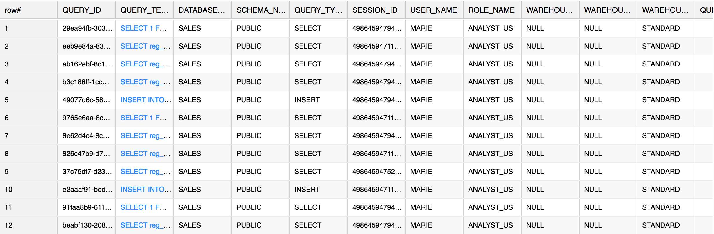
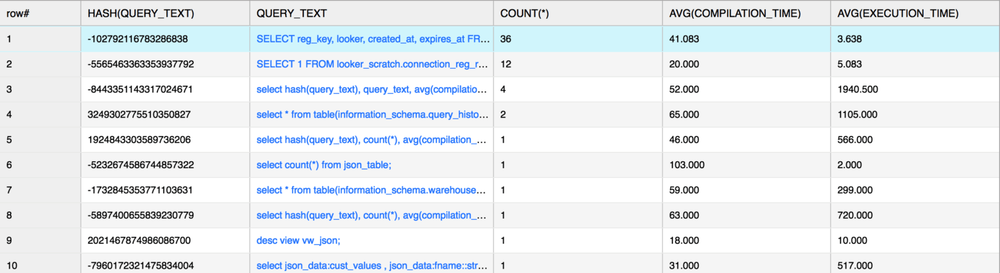
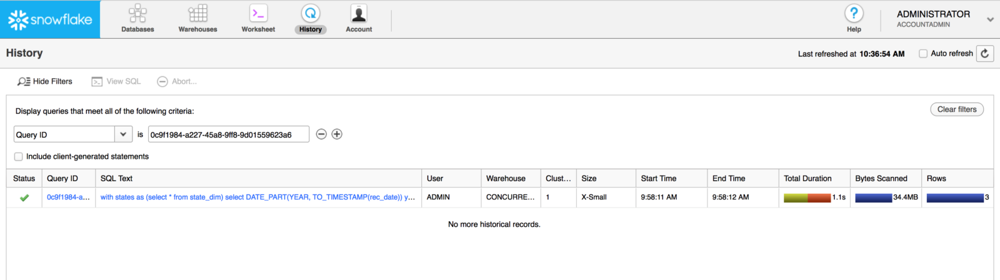
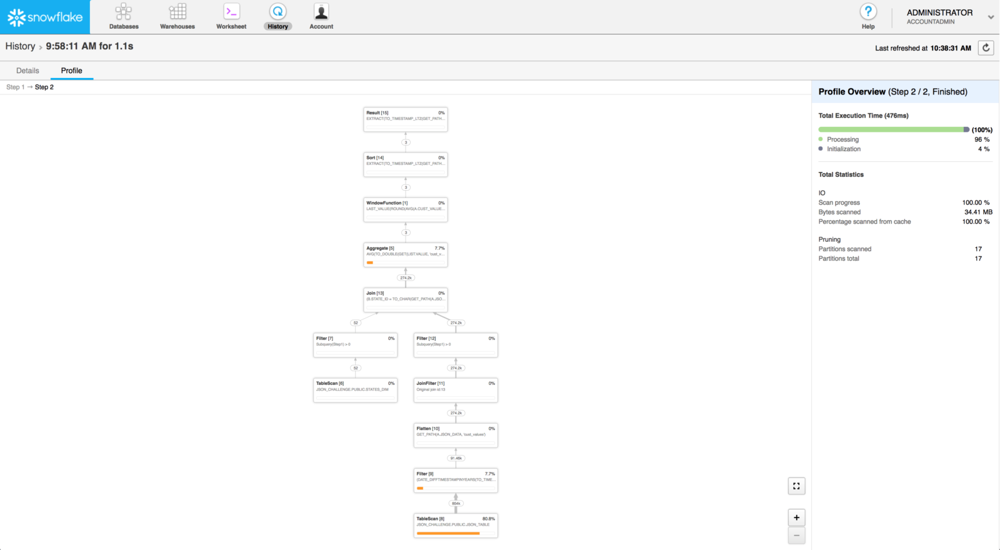

Understanding Your Snowflake Utilization: Part 3 \-- Query Profiling
====================================================================

This lab about query profiling is the third in a three-part series
to help you utilize the functionality and data in
Snowflake's Information Schema to better understand and effectively Snowflake.


In this lab, I will deep-dive into understanding query profiling.
To do this, I will show you examples using the QUERY\_HISTORY family of functions. I will also show you a handy page in the UI that provides
a graphical view of each query. Keep in mind that you'll need warehouse
MONITOR privileges to perform the tasks described in this lab.
Typically, the SYSADMIN role has the necessary warehouse
MONITOR privileges across your entire account; however, other
lower-level roles may also have the necessary privileges.

Ready to get started? Here we go!

### Query History Profiling

Query profiling is perhaps one of the more popular topics. Many people are interested in improving their query
performance. Although every development team should strive to
periodically refactor their code, many find it challenging to determine
where to start. Going through this analysis should help with identifying
a good starting point.

Let's look at some syntax, per our documentation
for [QUERY\_HISTORY]:

```
select *
from table(information_schema.query_history(dateadd('hours',-1, current_timestamp()),current_timestamp()))
order by start_time;
```

This query provides a view into all of the queries run by the current
user in the past hour:



We can also leverage the QUERY\_HISTORY companion functions to narrow
down your focus:

-   QUERY\_HISTORY\_BY\_SESSION
-   QUERY\_HISTORY\_BY\_USER
-   QUERY\_HISTORY\_BY\_WAREHOUSE

These are particularly useful if you have identified specific workflow
issues you need to address.

#### Profiling Tip \#1: Using HASH()

Now for a particularly useful tip: utilizing HASH on the QUERY\_TEXT
column can help you consolidate and group on similar queries (the HASH
function will return the same result if any queries are exactly the
same). As a general rule, identifying query groups and finding the max
and min query runtime should help you sort through specific workflows.
In the example below, I'm doing an analysis on average compile and
execution time. Additionally, I'm collecting a count of the queries with
the same syntax:

```
select hash(query_text), query_text, count(*), avg(compilation_time), avg(execution_time)
from table(information_schema.query_history(dateadd('hours',-1,current_timestamp()),current_timestamp()))
group by hash(query_text), query_text
order by count(*) desc;
```

Output:



Using the HASH function further allows a user to easily query a
particular instance of this query from the QUERY\_HISTORY function. In
the example above, I could check for specific queries where the HASH of
the query text converted to the value `-102792116783286838`. For
example:

```
select *
from table(information_schema.query_history())
where hash(query_text) = -102792116783286838
order by start_time;
```

Output:


The above result shows you all of the times you have issued this
particular query (going back 7 days). Pay specific attention to the
following columns:

-   COMPILATION\_TIME
-   EXECUTION\_TIME
-   QUEUED (times)

If a query is spending more time compiling (COMPILATION\_TIME) than
executing (EXECUTION\_TIME), perhaps it is time to review the complexity
of the query. Snowflake's query compiler will optimize your query and
identify all of the resources required to perform the query in the most
efficient manner. If a query is overly complex, the compiler needs to
spend more time sorting through the query logic. Take a look at your
query and see if there are many nested subqueries or unnecessary joins.
Additionally, if there are more columns being selected than required,
then perhaps be more specific in your SELECT statement by specifying
certain columns.

QUEUED time is interesting because it could be an indicator about your
warehouse size and the amount of workload you've placed on the
warehouse. Snowflake is able to run concurrent queries and it does a
very good job in doing so. However, there will be times when a
particularly large query will require more resources and, thus, cause
other queries to queue as they wait for compute resources to be freed
up. If you see a lot of queries spending a long time in queue, you could
either:

-   Dedicate a warehouse to these large complex running queries, or
-   Utilize Snowflake's multi-clustering warehouse feature to allow more
    parallel execution of the queries.

In the recent updates to our QUERY\_HISTORY\_\* Information Schema
functions, we have added more metadata references to the results and now
you should have a range of metadata at your disposal:

-   SESSION\_ID
-   USER\_NAME , ROLE\_NAME
-   DATABASE\_NAME , SCHEMA\_NAME
-   WAREHOUSE\_NAME , WAREHOUSE\_SIZE , WAREHOUSE\_TYPE

These columns will help you identify the origin of the queries and help
you fine tune your workflow. A simple example would be to find the
warehouse with the longest-running queries. Or, find the user who
typically issues these queries.

#### Profiling Tip \#2: Using the UI

Once you have identified a particular query you would like to review,
you can copy its QUERY\_ID value and use this value to view its query
plan in Snowflake's Query Profile. To do this, click
on the **History** icon, add a QUERY ID filter, and paste the QUERY\_ID
in question. For example:



**Hint:** If you don't see a result, make sure you are using a role with
the necessary warehouse MONITOR privilege (e.g. SYSADMIN or
ACCOUNTADMIN) and you've selected the correct QUERY ID.

Once the search is complete, you should be able to click on the link
provided under the **Query ID** column to go to the query's detail page:


Now click on the **Profile** tab.

You should see a visualization of the Query Profile. In my example,
Snowflake shows that this particular query executed in two steps:

**Step 1:**


**Step 2:**



Pay particular attention
to the ***orange*** bar in this view. It indicates the percentage of
overall query time spent on this particular process. In this instance,
we can see our query spent most of the time reading data from the table.
If we run this query often enough, we should see this time decrease
because we'll be reading the data from cache instead of disk.

### Conclusion

By utilizing the UI and the Information Schema functions and views
described in this lab, you can use query profiling to help you
understand your current workflow and identify queries that can be better
optimized. This will help save you money in the long run and also
improve your user experience. Snowflake will continue to invest in tools
like these to help our users better understand and use our platform.

