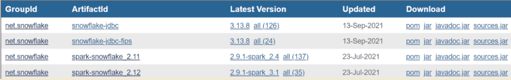

How to Connect to Snowflake Using Spark
=======================================


Spark processes large volumes of data and theSnowflake Data
Cloud is a modern data platform, together they help enterprises make more
data-driven decisions. But how does one go about connecting these two
platforms? 

Whether you're interested in using Spark to execute SQL queries on a
Snowflake table or if you just want to read data from Snowflake and
explore it using the Spark framework, this lab will walk you through: 

-   The installation and configuration of the Spark Snowflake Connector
-   How to establish a Snowflake connection using PySpark
-   How to establish a Snowflake connection using Scala


How to Install and Configure The Spark Snowflake Connector
----------------------------------------------------------


To use the Spark Snowflake connector, you will need to make sure that
you have the Spark environment configured with all of the necessary
dependencies. The dependencies in question are the Snowflake JDBC
driver, Spark Snowflake Connector (SSC), and the Spark framework itself.


### Step 1


The first thing you need to do is decide which version of the SSC you
would like to use and then go find the Scala and Spark version that is
compatible with it. The SSC can be downloaded from [Maven](https://search.maven.org/search?q=g:net.snowflake) (an
online package repository). In the repository, there are different
package artifacts for each supported version of Scala, and within the
Scala versions, there are different versions of the SSC. 

In addition, there are separate artifacts that support different
versions of the Spark framework. The SSC packages have the following
naming conventions, "X.X.X-spark\_Y.Y"  

The three X's represent the version of Snowflake and the two Y's
represent the version of Spark. For example, Snowflake version 2.9.1 or
Spark version 3.1.





### Step 2


Once you have found the version of the SSC you would like to use, the
next step would be to download and install its corresponding jar files
and the jar files for the dependencies mentioned above in your Spark
cluster.

The [spark-shell --packages]command can be
used to install both the Spark Snowflake Connector and the Snowflake
JDBC driver in your local Spark cluster. It can also be used to install
any other missing packages required for SSC.


#### Example command:


```
spark-shell --packages net.snowflake:snowflake-jdbc:3.12.17,net.snowflake:spark-snowflake_2.12:2.8.4-spark_3.0
```


How to Connect to Snowflake using PySpark
-----------------------------------------


#### Install PySpark:

`pip install pyspark`


To enable Spark in Python, the PySpark script in the Spark distribution
is required. What this means is that as we needed to install the SSC and
Snowflake JDBC driver in the Spark shell script, we will have to do the
same for the PySpark script using the command given below.


#### Example command:


```
pyspark --packages net.snowflake:snowflake-jdbc:3.8.0,net.snowflake:spark-snowflake_2.11:2.4.14-spark_2.4
```


[PRO TIP:] Be sure to include the SSC and
Spark JDBC driver in your Class Path environment variables so that the
PySpark distribution recognizes the installation.


Now that we have our environment setup, the next step is to run our
Python code that will allow us to `connect to Snowflake`
using PySpark. The first setup in our code would be to import the
necessary libraries and establish our Spark context for a local Spark
cluster.


#### Example Code:


```
#import required libraries
from pyspark import SparkConf, SparkContext
from pyspark.sql import SQLContext

mySparkContext = SparkContext("local", "example App")
spark = SQLContext(mySparkContext )
spark_conf = SparkConf().setMaster('local')
```


Once the Spark context is set up, the next step is to create a python
dictionary that contains the required Snowflake parameters to establish
the Snowflake connection. 


### Required Parameters:


- `Account Identifier`-- Unique identifier for
your Snowflake account, either created by your organization or
automatically generated by Snowflake upon account creation

- `User Name` -- User name for your Snowflake
account, created during account creation

- `Password`-- Password for your account,
created during account creation

- `Database`-- Database in the Snowflake
account that you are attempting to access

- `Schema` -- Schema within the database that
you are attempting to access

- `Warehouse` -- Snowflake compute resources
that are being used for your operations


#### Example Code:


```
# Snowflake connection parameters
sfparams = {
  "sfURL" : "<account_identifier>.snowflakecomputing.com",
  "sfUser" : "<user_name>",
  "sfPassword" : "<password>",
  "sfDatabase" : "<database>",
  "sfSchema" : "<schema>",
  "sfWarehouse" : "<warehouse>"
}
```


The final step would be to read in a [Snowflake
table] into a
Spark dataframe to verify that the connection has been established. To
do this, the [dbtable]option has to be
specified on the Spark dataframe. If you would like to execute a custom
query, then the [query] option would need to
be specified instead.


#### Example Code:


```
#read full table
df = spark.read.format("snowflake") \
  .options(**sfparams) \
  .option("dbtable",  "Employee") \
  .load()

#run custom query
df = spark.read.format("snowflake") \
  .options(**sfparams) \
  .option("query",  "SELECT * FROM Employee") \
  .load()
```

