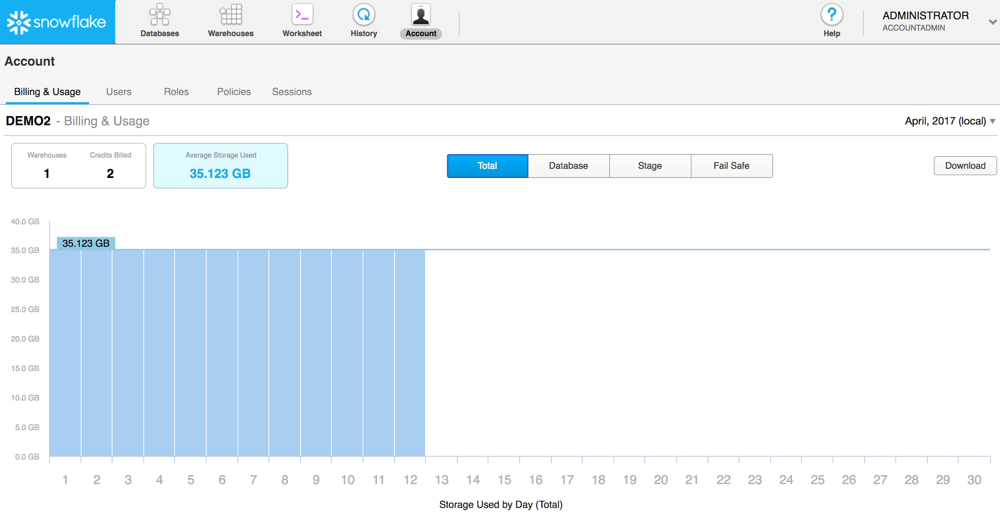
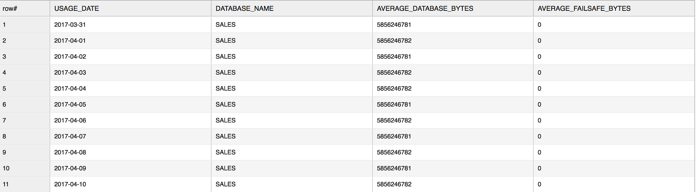
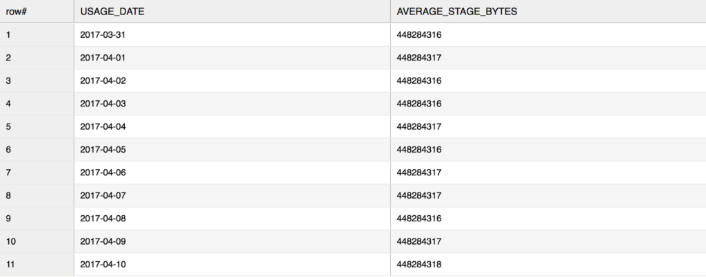
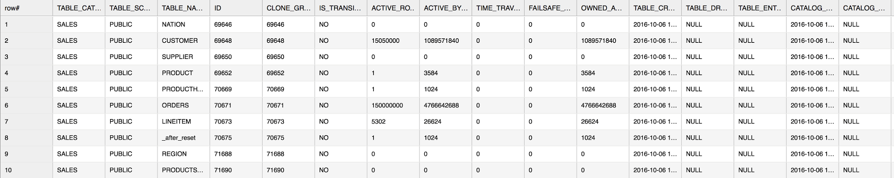
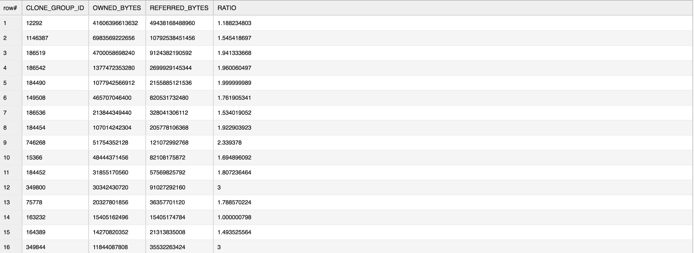
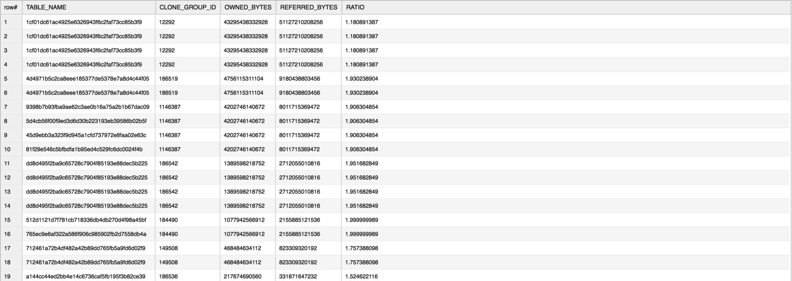

Understanding Your Snowflake Utilization, Part 2: Storage Profiling
===================================================================

In this lab, I provide a deep-dive into understanding how you are
utilizing data storage in Snowflake at the database, stage, and table
level. To do this, I will show you examples of two functions and a view
provided in the Information Schema for monitoring storage usage. I will
also show you a handy page in the UI that provides an account-level view
of your storage. Keep in mind that you need ACCOUNTADMIN access to
perform any of the tasks described in this lab.

Let's get started.

### Summary Storage Profiling in the UI

Before diving into our detailed analysis of data storage, let's take a
quick look at the summary, account-level storage view provided by
Snowflake. As a user with the ACCOUNTADMIN role, you can navigate to
the **Account** page in the Snowflake UI to get a visual overview of
the data storage for your account.



This page provides a view, by month, of the average and daily storage
usage across your entire account. You can use the filters on the page to
filter by database, Snowflake stage, and data maintained in Fail-safe
(for disaster recovery).

### Detailed Storage Profiling Using the Information Schema

The Snowflake Information Schema provides two functions and one view for
monitoring detailed data storage at the database, stage, and table
level:

-   DATABASE\_STORAGE\_USAGE\_HISTORY (function)
-   STAGE\_STORAGE\_USAGE\_HISTORY (function)
-   TABLE\_STORAGE\_METRICS (view)

The DATABASE\_STORAGE\_USAGE\_HISTORY table function shows your database
status and usage for all databases in your account or a specified
database. Here's an example of the usage over the last 10 days for a
database named `sales`:

```
use warehouse mywarehouse;

select * from
table(sales.information_schema.database_storage_usage_history(dateadd('days',-10,current_date()),current_date(), ‘SALES’));
```



Note that the above screenshot only displays some of the output columns.
Also, per the Snowflake documentation:

> If a database has been dropped and its data retention period has
> passed (i.e. database cannot be recovered using Time Travel), then the
> database name is reported as DROPPED\_*id*.

At its core, the most useful insight from this function is the average
growth in your database. Keep in mind, the output includes both
AVERAGE\_DATABASE\_BYTES and AVERAGE\_FAILSAFE\_BYTES. Leveraging these
data points to derive a percentage
of `Fail-safe` over
actual database size should give you an idea of how much you should be
investing towards your Fail-safe storage. If certain data is not mission
critical and doesn't require Fail-safe, try setting these tables
to `transient`.
More granular information about Fail-safe data is provided in
TABLE\_STORAGE\_METRICS, which we will look at more closely later in
this lab.

Next, let's look at STAGE\_STORAGE\_USAGE\_HSTORY. This function shows
you how much storage is being used for staged files
across ***all*** your Snowflake staging locations, including named,
internal *stages*. Note that this function does not allow querying
storage on individual stages.

Here's an example of staged file usage for the last 10 days (using the
same database, `sales`, from the previous example):

```
select * from
table(sales.information_schema.stage_storage_usage_history(dateadd('days',-10,current_date()),current_date()));
```




Note that the above screenshot only displays some of the output columns.

Also note that you can only query up to 6 months worth of data using
this function. Some of our users like to use Snowflake stages to store
their raw data. For example, one user leverages table staging locations
for their raw data storage just in case they need to access the data in
the future. There's nothing wrong with this approach, and since
Snowflake compresses your staged data files, it certainly makes sense;
however, only the last 6 months of staged data storage is available.

Finally, the TABLE\_STORAGE\_METRICS view shows your table-level storage
at runtime. This is a snapshot of your table storage which includes your
active and Fail-safe storage. Additionally, you can derive cloned
storage as well utilizing the CLONE\_GROUP\_ID column. As of today, this
is the most granular level of storage detail available to users.

Here's a general use example (using the `sales` database):

```
select *
from sales.information_schema.table_storage_metrics
where table_catalog = 'SALES';
```



Note that the above screenshot only shows a portion of the output
columns.

In Snowflake, cloning data has no additional costs (until the data is
modified or deleted) and it's done very quickly. All users benefit from
"zero-copy cloning", but some are curious to know exactly what
percentage of their table storage actually came from cloned data. To
determine this, we'll leverage the CLONE\_GROUP\_ID column in
TABLE\_STORAGE\_METRICS.

For example (using a database named `concurrency_wh`):

```
with storage_sum as (
  select clone_group_id,
         sum(owned_active_and_time_travel_bytes) as owned_bytes,
         sum(active_bytes) + sum(time_travel_bytes) as referred_bytes
  from concurrency_wh.information_schema.table_storage_metrics
  where active_bytes > 0
  group by 1)
select * , referred_bytes / owned_bytes as ratio
from storage_sum
where referred_bytes > 0 and ratio > 1
order by owned_bytes desc;
```



The ratio in the above query gives you an idea of how much of the
original data is being "referred to" by the clone. In general, when you
make a clone of a table, the CLONE\_GROUP\_ID for the original table is
assigned to the new, cloned table. As you perform DML on the new table,
your REFERRED\_BYTES value gets updated.  If you join the
CLONE\_GROUP\_ID back into the original view, you get the output of the
original table along with the cloned table. A ratio of 1 in the above
example means the table data is not cloned.

If you need to find out the exact table name from the above query, then
simply join the CTE back to the TABLE\_STORAGE\_METRICS view and ask for
the TABLE\_NAME column.

For example (using the same database, `concurrency_wh`, from the
previous example):

```
with storage_sum as (
  select clone_group_id,
         sum(owned_active_and_time_travel_bytes) as owned_bytes,
         sum(active_bytes) + sum(time_travel_bytes) as referred_bytes
  from concurrency_wh.information_schema.table_storage_metrics
  where active_bytes > 0
  group by 1)
select b.table_name, a.* , referred_bytes / owned_bytes as ratio
from storage_sum a
join concurrency_wh.information_schema.table_storage_metrics b
on a.clone_group_id = b.clone_group_id
where referred_bytes > 0 and ratio > 1
order by owned_bytes desc;
```



### Conclusion

By utilizing the UI and the Information Schema functions and views
described in this lab, you can profile your data storage to help you
keep your storage costs under control and understand how your business
is growing over time. It's a good idea to take regular snapshots of your
storage so that you can analyze your growth month-over-month. This will
help you both formulate usage insight and take actions.

I hope this lab has given you some good ideas for how to manage your
Snowflake instance. Look for Part 3 of this series in coming weeks where
I will show you how to analyze your query performance. As already shown
in Parts 1 and 2, there are a lot of options to play with in Snowflake
and they're all intended to give you the flexibility and control you
need to best use Snowflake. Please share your thoughts with us!

